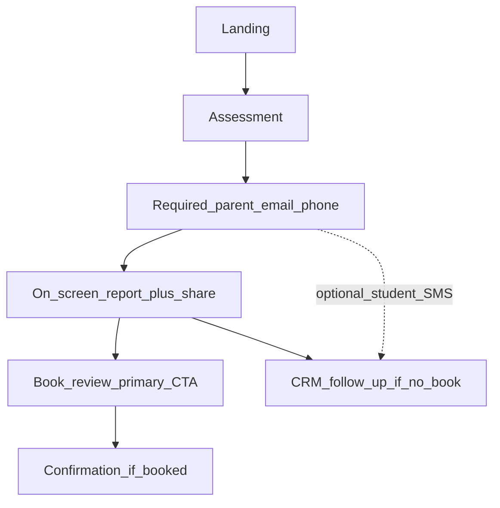
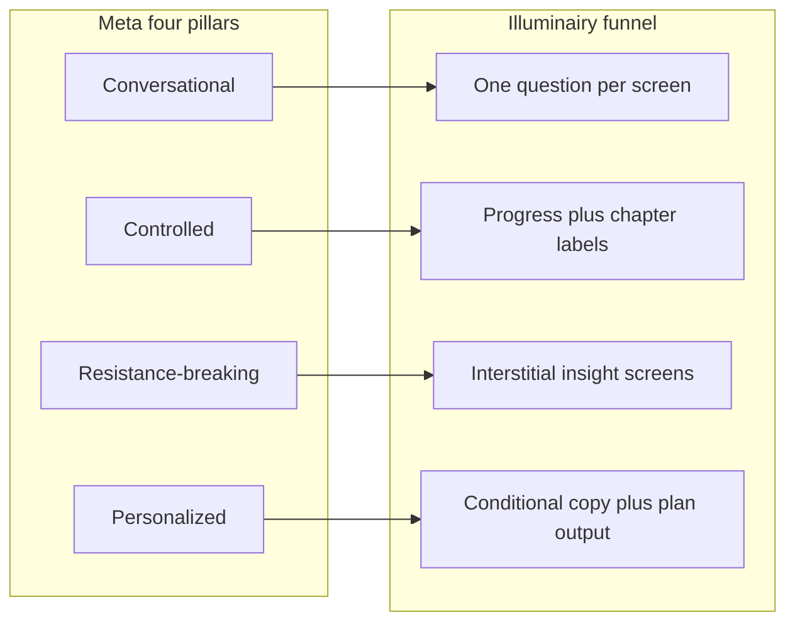
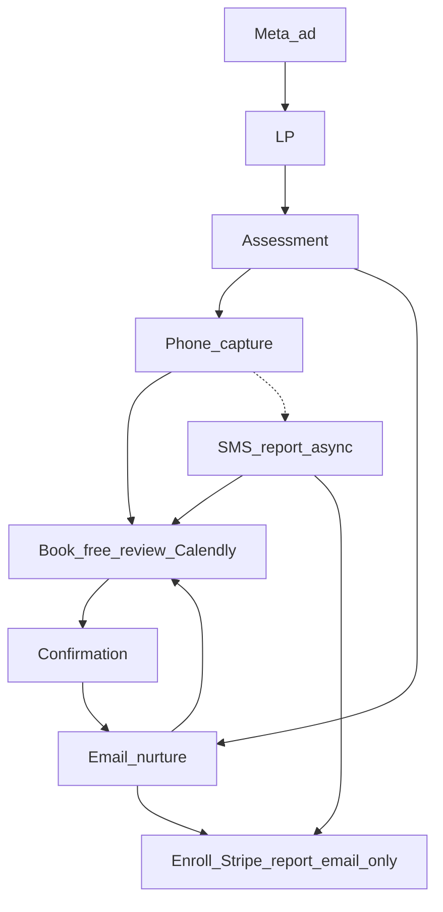
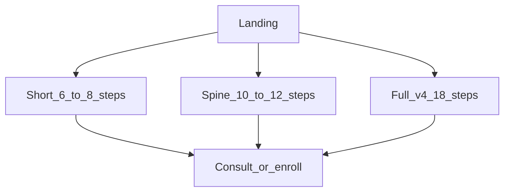

# Illuminairy SAT Quiz Funnel — Screen-by-Screen Plan

## Spec-driven development (source of truth)

| Doc | Path |
|-----|------|
| **ACTIVE** | [`specs/ACTIVE.md`](specs/ACTIVE.md) → `specs/sat-quiz-funnel/SPEC.md` |
| **PRD** (Gary Tan review + product) | [`specs/sat-quiz-funnel/PRD.md`](specs/sat-quiz-funnel/PRD.md) |
| **SPEC** (acceptance criteria) | [`specs/sat-quiz-funnel/SPEC.md`](specs/sat-quiz-funnel/SPEC.md) |
| **Ralph tasks** (one per session) | [`specs/ralph/PLAN.md`](specs/ralph/PLAN.md) |
| **This file** | Full synthesis + screen map (reference) |
| **Tooling matrix** | [`specs/AGENT-TOOLING.md`](specs/AGENT-TOOLING.md) |
| **Funnel ops metrics** | [`files/funnel-analysis.md`](files/funnel-analysis.md) |
| **Performance & load times** | [`files/funnel-performance.md`](files/funnel-performance.md) |

**Rule:** Change PRD/SPEC first for product decisions; update this PLAN for narrative/architecture; implement only what SPEC lists.

## Agent tooling (installed — what to use)

See **[`specs/AGENT-TOOLING.md`](specs/AGENT-TOOLING.md)** for the full matrix. Summary:

| Phase | Primary tools |
|-------|----------------|
| **Plan** | Spec-driven PRD/SPEC; Cursor `illuminairy-plan`; optional gstack `/office-hours` in Claude Code |
| **Prototype UI** | Cursor Agent; Claude Code **frontend-design** plugin; aesthetics **cookbook** as reference only |
| **Build tasks** | `specs/ralph/PLAN.md` + Cursor (`ralph-iteration`); **not** snarktank `ralph.sh` for this project |
| **Review / ship** | `illuminairy-review` / `illuminairy-ship`; gstack `/review`, `/qa`, `/ship` in Claude Code |
| **Verify (Next.js)** | `npm run agent:verify` — engineering autoresearch-lite; **not** karpathy GPU autoresearch |
| **Live experiments** | `files/funnel-analysis.md` + growth autoresearch discipline |
| **Avoid v1** | `/ralph-loop` on whole funnel; Meta Lead pixel; overnight autonomous loops |

**MVP path (decided):** **Spine** — assessment → contact → on-screen report → book call; v4 interstitials are optional plugins after metrics.

## What you already have

| Asset                                           | Location                                                                                                                               | Status                                                                                   |
| ----------------------------------------------- | -------------------------------------------------------------------------------------------------------------------------------------- | ---------------------------------------------------------------------------------------- |
| Landing (lagoon, score cards, CTA)              | `[New Funnel for Illuminairy/](New Funnel for Illuminairy/)` (`app.jsx`, `styles.css`, `score-cards.jsx`)                              | **Done** — CTA still `alert()`; needs wiring to Screen 2                                 |
| Full copy/architecture (18 screens, 4 chapters) | `[files/illuminairy_funnel_v4_final.md](files/illuminairy_funnel_v4_final.md)`                                                         | **Outline locked** — use as source of truth for copy + logic                             |
| ICP, voice, palette, wordmark direction         | `[files/illuminairy_brand_kit_brief.md](files/illuminairy_brand_kit_brief.md)`                                                         | Brand guardrails                                                                         |
| North Star concept (official)                   | `[docs/visual-identity.md](docs/visual-identity.md)`                                                                                   | 4-point star, gold on navy — **not** the current site wordmark you dislike               |
| Constellation mark (prototype)                  | `[New Funnel for Illuminairy/constellation.jsx](New Funnel for Illuminairy/constellation.jsx)`                                         | Interim spark mark until north-star wordmark is designed                                 |
| Product facts ($99/wk, sessions, dates)         | `[lib/site.ts](lib/site.ts)` in main repo                                                                                              | Pull tuition/dates from here when integrating checkout                                   |
| Noom swipe file (139 screens)                   | `[quizfunnel/noomswipefiles/](quizfunnel/noomswipefiles/)`                                                                             | Reference only                                                                           |
| Meta scorecard                                  | User image + `[Downloads/Top 0.1% of Meta Funnels.fig](file:///Users/briannazajicek/Downloads/Top%200.1%25%20of%20Meta%20Funnels.fig)` | Four pillars (see synthesis below)                                                       |
| Hims breakdown                                  | [ConvertFlow Hims full-funnel article](https://www.convertflow.com/campaigns/hims-full-funnel-marketing-examples-templates)            | DTC scaling patterns (see below)                                                         |
| **ConvertFlow Funnel Swipe File**               | [cf-swipe-files.notion.site](https://cf-swipe-files.notion.site/) (Denney Bros / *The Funnels Show*)                                   | 30+ teardowns with Figma flows + step tags — **primary DTC pattern library** (see below) |
| Perspective template                            | [template.perspectivefunnel.com/a/](https://template.perspectivefunnel.com/a/)                                                         | Call-booking flow UX (walked live — see below)                                           |
| Screen 2 placeholder                            | `[New Funnel for Illuminairy/Screen 2.html](New Funnel for Illuminairy/Screen 2.html)`                                                 | Empty — **next build target**                                                            |

**Deploy choice (confirmed):** Stay in the prototype folder until the funnel is further along; port to Next.js later (prior `[specs/2026-05-sat-funnel/SPEC.md](specs/2026-05-sat-funnel/SPEC.md)` can inform that migration).

**Business model (confirmed):** One funnel end-to-end, one ICP (SAT mom), one offer (SAT Accelerator). Not a multi-product store — the Denney Bros “single optimized funnel” thesis **is** the business.

---

## Planning stance — nothing is “locked” until data says so

`[illuminairy_funnel_v4_final.md](files/illuminairy_funnel_v4_final.md)` is a **creative outline**, not proof. Swipe files show what *can* work, not what *will* work for Illuminairy at ~$1k–2k with zero brand recognition on cold Meta.

**How to read this plan:**

- **Non-negotiables:** brand kit (no guarantees, no fake urgency), one offer/ICP, legal consent, instrumentation, facts in `lib/site.ts` when integrated.
- **Hypotheses:** screen count, six interstitials, SMS report, $99/wk, phone-before-offer order, chapter structure, consult vs enroll hierarchy.
- **Build order:** infrastructure + **spine** first; treat interstitials as **plugins** you add when drop-off data justifies them — not as 12 screens you owe v4.

**Wrong failure mode:** building all 18 screens because the doc says so, then discovering completion is 25%.

**Right failure mode:** ship the shortest path that can **book a consult** in 2 weeks of traffic; add self-serve checkout only after offer/PMF is validated.

---

## Conversion model — v1 (locked)

**North star (until PMF):** **Consult booked** — not ecommerce checkout on the funnel.

### Report + contact + book — **locked (user confirmed)**

**v1 close (revised):**

1. **Assessment**
2. **Contact (required)** — parent email + phone to **see** the plan; TCPA consent; optional: “Text [Name] a copy” (student phone)
3. **On-screen report** — instant (no “we’ll email in 10 min” as the only delivery)
4. **Report page** — **Share** + **primary CTA:** book free 15-min SAT Improvement Plan review; **may leave** (you have contact for follow-up)
5. **Confirmation** — if they booked

**Gate:** Contact before report (Option A) — fair exchange: “Enter your info to get [Name]’s plan.”  
**Not gated:** Call — they can exit after the report; nurture drives re-book.

**Meta / ads:** Campaign goal = **appointments**. Send **only booking/schedule completion** to Meta (custom “Result” or standard Schedule event on Calendly confirm). **Do not** fire Lead events on contact submit — keeps the algorithm optimizing for people who book, while you still store leads in your CRM for manual/SMS/email follow-up.

**SMS in v1:** **Optional, not required.** Skip building SMS delivery for launch if it slows you down. Add later as:

- “Text me a copy” checkbox on the report screen, or  
- Abandonment-only (“You didn’t book — here’s the link + one insight”), or  
- Post-call follow-up.

**Email:** Capture for nurture when you have it (optional on report screen or after book); sequences carry **book call** + **enroll** when Stripe is live.

| Layer                   | Goal                      | Primary CTA                  | Secondary                                |
| ----------------------- | ------------------------- | ---------------------------- | ---------------------------------------- |
| **Funnel (web)**        | See report → book call    | Calendly: free 15-min review | No enroll on web; no skip past book step |
| **SMS** (optional v1.1) | Copy of report + reminder | Book call                    | Enroll link when live                    |
| **Email**               | Nurture non-bookers       | Book call                    | Enroll when live                         |
| **Post-PMF**            | Self-serve                | Funnel checkout optional     | After calls validate offer               |

**Not v1 on the website:** Subscribe-offer page, Stripe checkout, SMS-as-only delivery of the report.

### End-to-end flow (v1)

1. **Assessment** — qualify + personalize.
2. **On-screen report** — GPA/SAT gap, realistic range, weeks to test, plan summary (scrollable; shareable via browser if mom screenshots).
3. **Book call** — single path forward: “Walk through this plan with an SAT expert.” Embedded Calendly.
4. **Confirmation** — “You’re booked” + recap; optional “text me a copy” if SMS is on.
5. **SMS / email** — backup channels for people who closed before booking — not the primary delivery.

### Why not SMS-first for call-first PMF

| SMS-first                                          | On-screen + book                        |
| -------------------------------------------------- | --------------------------------------- |
| Mom waits minutes; momentum dies                   | Instant payoff for 3–4 min of questions |
| TCPA + send pipeline before you’ve validated calls | Simpler prototype                       |
| Report competes with “book now” on the site        | One job on site: **calendar**           |
| Good for brands with huge SMS ops                  | Good when **consult** is the product    |

SMS still wins later for **retargeting** people who viewed the report and bounced — you’ll want a contact method. Capture **phone or email** on or after the report screen, but don’t make SMS the only way to see the plan.

### Three variants (if you A/B later)

| Variant                    | Flow                                   | Risk                                         |
| -------------------------- | -------------------------------------- | -------------------------------------------- |
| **A — Recommended**        | Report on screen → book call (no skip) | Some bounce without booking; acceptable      |
| **B — SMS-first (old v4)** | Phone → async text → book              | Lower same-session book rate                 |
| **C — Hard gate**          | Teaser only until call booked          | Highest distrust; avoid for Illuminairy tone |

### Report screen + book screen copy direction

**Report screen (new — replaces “phone for SMS” as value delivery):**

- **Headline:** [Name]’s SAT Improvement Plan  
- **Body:** Personalized blocks from assessment (gap, timeline, recommended focus).  
- **Footer CTA:** Book your free 15-minute plan review → goes to Calendly step.

**Book screen (if separate from embed):**

- **Headline:** Book your free 15-minute SAT Improvement Plan review  
- **Sub:** Walk through what you just saw with an SAT expert — what’s blocking progress and what to do before [test date].  
- **CTA:** Choose a time (Calendly)  
- **Micro:** Free · No obligation · Not a sales pitch (if true operationally)  
- **Do not show** $99/week or checkout on this screen in v1.

### Metrics & diagnostics (build in from day one)

**Goal:** When the funnel is live, you can see **which scenario** you’re in and **what to change** — not guess from vanity CPL.

**Living playbooks:**

| Playbook | Covers |
|----------|--------|
| [`files/funnel-analysis.md`](files/funnel-analysis.md) | Events, conversion formulas, scenario matrix, weekly ops review |
| [`files/funnel-performance.md`](files/funnel-performance.md) | **Speed tests, load times, CWV budgets**, lab + device gates, RUM |

Update conversion thresholds after ~500 sessions per step; update perf baselines when LP/global CSS/scripts change.

### Performance, speed tests & load times

Meta LP bounce is often **speed + IAB**, not copy. Treat performance like instrumentation — defined before scale.

**Budgets (mobile, production):** LCP ≤ **2.5s**, INP ≤ **200ms**, CLS ≤ **0.1**, LP interactive ≤ **3.5s** on Slow 4G. Full table + tools: [`files/funnel-performance.md`](files/funnel-performance.md).

| Phase | What to run |
|-------|-------------|
| **Each screen sign-off** | Lighthouse mobile on `Landing.html` + new `?step=` URL; perf section in `files/screens/screen-NN-….md` |
| **Before Meta spend** | Real device: Instagram + Facebook IAB cold open; fill [`files/research/perf-baseline-YYYY-MM-DD.md`](files/research/perf-baseline-2026-05-23.md) |
| **Prototype (now)** | Regression checks only — unpkg React+Babel is **dev-only**, not a ship budget |
| **Next.js port** | No in-browser Babel; `next/font` + `next/image`; defer analytics; Calendly lazy; Vercel Speed Insights |
| **Live (weekly)** | GA4 LP bounce vs step depth; PostHog web vitals (optional); Meta LP CTR anomalies |

**Speed test stack:**

| Tool | Use |
|------|-----|
| Chrome **Lighthouse** (mobile, Slow 4G) | Lab LCP/INP/CLS per screen — default gate |
| **WebPageTest** | Staging TTFB + filmstrip before launch |
| **DevTools Network** | Transfer size, blocking scripts, font waterfall |
| **Meta IAB on iPhone** | Real-world cold load (pairs with [`meta-in-app-browser-qa.md`](files/research/meta-in-app-browser-qa.md)) |
| **Vercel Speed Insights** | Field CWV on production `/go/…` |
| **Lighthouse CI** (optional) | Block deploy if LP LCP regresses |

**RUM (Next.js):** `web-vitals` → same `trackFunnelEvent` / GA4 as conversion events; sample `funnel_step_timing` in dev if step transitions regress.

**Diagnostic link:** High LP views + low `funnel_cta_click` → check LCP and IAB layout before rewriting headline ([`funnel-performance.md` § Diagnostics](files/funnel-performance.md)).

### Analytics — PostHog + Google Analytics (dual instrument)

**Both tools from first deploy** (prototype and Next.js). One shared helper fires each step to **PostHog** and **GA4** so funnels stay in sync.

| Tool           | Role                                                                       | Where configured                                                                                                                                                 |
| -------------- | -------------------------------------------------------------------------- | ---------------------------------------------------------------------------------------------------------------------------------------------------------------- |
| **PostHog**    | Step funnels, breakdowns (`utm_campaign`, `path`), session replay optional | `[lib/posthog.ts](lib/posthog.ts)`, `[components/posthog-provider.tsx](components/posthog-provider.tsx)`, `[lib/analytics-capture.ts](lib/analytics-capture.ts)` |
| **GA4**        | Ads/Google reporting, `generate_lead`, bounce vs LP                        | `[components/google-analytics.tsx](components/google-analytics.tsx)` (`G-B1XC1ND9GT` today)                                                                      |
| **Meta pixel** | **Bookings only** — not contact submit                                     | Calendly thank-you / `consult_booked`                                                                                                                            |

**Prototype (`prototype/`):**

- `analytics.js` with `trackFunnelEvent(name, props)` → `posthog.capture` + `gtag('event', …)` (stub today).
- Load PostHog init (use `NEXT_PUBLIC_POSTHOG_KEY` from `.env` when testing locally; document in `.env.example`).
- Load GA4 gtag on `Landing.html` + funnel pages (same measurement ID as main site **or** separate GA4 property for `/go/sat` — decide before spend; separate property keeps funnel clean).
- Manual `$pageview` / `page_view` on step changes if SPA router (no full page reload).
- **Defer** analytics scripts until after first paint when wiring for real (see [`funnel-performance.md`](files/funnel-performance.md)).

**Next.js port:**

- Extend `[lib/analytics-events.ts](lib/analytics-events.ts)` with new constants (do not rename mid-experiment):
  - `contact_submit`, `report_view`, `report_share_click`, `calendly_open`, `consult_booked` (plus existing `funnel_landing_view`, `funnel_cta_click`, `intake_step_view`, `intake_completed`, `assessment_start`).
- Extend `captureAnalytics()` (or `captureFunnelEvent()`) to call **PostHog + gtag** in one place.
- PRD/SPEC: GA4 `[generate_lead](specs/2026-05-sat-funnel/SPEC.md)` on `**contact_submit`** (parent captured before report) — revise from intake-only if SPEC still says intake_completed only.
- GA4 **key event** for optimization: mark `consult_booked` (or `schedule`) as conversion in GA4 UI; mirror Meta.

**PostHog dashboard:** Create/update per `[growth/posthog-funnel-dashboard.md](growth/posthog-funnel-dashboard.md)` — add steps: `contact_submit` → `report_view` → `calendly_open` → `consult_booked`.

**Env (integration):** `NEXT_PUBLIC_POSTHOG_KEY`, `NEXT_PUBLIC_POSTHOG_HOST`; GA ID via existing component or `NEXT_PUBLIC_GA_MEASUREMENT_ID` if you parameterize it.

### CRM — Supabase `leads` table

**On `contact_submit`:** Persist every parent who unlocks the report into Supabase `**leads`** (existing CRM — `[lib/crm/leads.ts](lib/crm/leads.ts)`, schema `[supabase/migrations/20260518120000_crm_schema.sql](supabase/migrations/20260518120000_crm_schema.sql)`).

| Funnel field                                | `leads` column                                                                                                                         |
| ------------------------------------------- | -------------------------------------------------------------------------------------------------------------------------------------- |
| Parent email                                | `parent_email` (unique upsert key)                                                                                                     |
| Parent phone                                | `parent_phone`                                                                                                                         |
| Parent name (if collected)                  | `parent_first` / `parent_last` (last optional in v1)                                                                                   |
| Student first name (assessment)             | `student_first`                                                                                                                        |
| Student grade / school / test date / scores | `student_grade`, `student_school`, `target_exam`, `sat_baseline`, `score_range`, `main_goal` — map from funnel answers where available |
| Full assessment + worries + `path`          | `additional_context` (JSON string)                                                                                                     |
| Optional student SMS phone                  | `additional_context` or `sales_notes` until dedicated column                                                                           |
| UTMs, `fbclid`, landing                     | attribution columns + `lead_source` via `[deriveLeadSource](lib/attribution)`                                                          |
| PostHog `visitor_id`                        | `visitor_id` + link `[touch_events](lib/crm/touch.ts)`                                                                                 |
| Initial stage                               | `intake_submitted`                                                                                                                     |
| After Calendly book                         | Update: `stage` → `call_booked`, `booked_call_at`, `calendly_event_uri` (webhook or client callback)                                   |

**API (Next.js port — Phase B):**

- New `POST /api/funnel/lead` (or `POST /api/funnel/contact`) — lighter than full `[/api/intake](app/api/intake/route.ts)` (no program-investment disqualify flow required on first touch).
- Server: `upsertLeadFromFunnel()` reusing `getSupabaseAdmin()` + same upsert-by-email pattern as `upsertLeadFromIntake`.
- **Then Klaviyo** (same request, after Supabase succeeds) — not optional when `KLAVIYO_PRIVATE_API_KEY` is set.
- Prototype: mock POST or hit staging API when testing; **do not** leave contacts only in `sessionStorage`.

**Klaviyo (on contact submit):**

Add `onFunnelContactSubmitted()` in [`lib/klaviyo-server.ts`](lib/klaviyo-server.ts) (mirror [`onIntakeSubmitted`](lib/klaviyo-server.ts)):

1. **`upsertKlaviyoProfile`** — email, first name, phone; properties: `lead_stage: intake_submitted`, `lead_source`, `student_first_name`, `target_exam`, `score_range`, UTM fields, `funnel_path`.
2. **`trackKlaviyoEvent`** — metric **`SAT Funnel Contact`** → triggers nurture flows in Klaviyo UI (book-call reminders if no booking).
3. Optionally persist `klaviyo_profile_id` on the `leads` row.

**Klaviyo (on Calendly book):** Existing [`handleCalendlyInviteeCreated`](lib/crm/calendly-webhook.ts) → **`Consultation Booked`** + `stage: call_booked`. Funnel leads must use the **same email** as Calendly.

**Klaviyo flows (build in Klaviyo UI — Phase B):**

| Trigger | Purpose |
|---------|---------|
| `SAT Funnel Contact`, no book in 24h | Nurture → book free review |
| `Consultation Booked` | Confirm + call prep |
| Post-call (later) | Enroll when Stripe live |

**Env:** `KLAVIYO_PRIVATE_API_KEY` (server); `NEXT_PUBLIC_KLAVIYO_COMPANY_ID` if onsite script on funnel pages.

**Errors:** Supabase fail → **502**, do not show report. Klaviyo fail → log + still show report (or retry async — prefer log-only so UX isn’t blocked).

**Not in scope for contact row:** creating `clients` / `enrollments` — those stay on Stripe enroll + webhook later.

**Build into the prototype / Next.js funnel (Phase A–B):**

| Event (PostHog / internal) | Fires when                      | Used for                       |
| -------------------------- | ------------------------------- | ------------------------------ |
| `funnel_landing_view`      | LP load                         | Denominator for LP metrics     |
| `funnel_cta_click`         | Start assessment                | LP → start rate                |
| `assessment_start`         | First quiz screen               | Confirms entry                 |
| `intake_step_view`         | Each step (`step_id`, `path`)   | Step drop-off heatmap          |
| `assessment_complete`      | Last input before contact       | Assessment → contact           |
| `contact_submit`           | Parent email+phone valid submit | Contact gate                   |
| `report_view`              | Report screen rendered          | Contact → report (tech + gate) |
| `report_share_click`       | Share tapped                    | Optional engagement            |
| `calendly_open`            | Book CTA / embed opened         | Report → intent                |
| `consult_booked`           | Calendly confirmed (webhook)    | **Primary funnel outcome**     |
| `consult_show`             | Call happened (manual tag)      | Show rate                      |
| `consult_closed_enroll`    | Enrolled on call (manual/CRM)   | PMF / offer                    |

**Meta:** Fire **only** `consult_booked` (or Schedule) to the ads pixel — not `contact_submit`. Store leads in CRM separately.

**Derived rates** (compute in PostHog or weekly sheet):

- `lp_start` = starts / LP views  
- `assess_complete` = assessment_complete / starts  
- `contact_rate` = contact_submit / assessment_complete  
- `report_rate` = report_view / contact_submit  
- `book_intent` = calendly_open / report_view  
- `book_rate` = consult_booked / report_view (**headline funnel metric**)  
- `show_rate` = consult_show / consult_booked  
- `close_rate` = consult_closed_enroll / consult_show

**PRD week-1 targets** (hypotheses until baseline — see PRD): LP→start >25%, intake completion >60%; add **report→booked >15%** as a working consult funnel target after first 100 report views.

**Scenario → action:** Full matrix in `[files/funnel-analysis.md](files/funnel-analysis.md)`. Summary:

| If this is weak…          | Likely scenario              | Change to test                                              |
| ------------------------- | ---------------------------- | ----------------------------------------------------------- |
| LP→start                  | Ad/LP mismatch or weak hook  | New hero, message-match ad kit                              |
| Start→assessment_complete | Funnel too long / bad step   | Cut interstitials, `path=short`, fix one high drop-off step |
| Complete→contact          | Gate too early or scary form | Copy (“instant plan”), fewer fields, trust line             |
| Contact→report_view       | Bug or slow load             | Performance, instant render, error logging                  |
| Report→calendly_open      | Weak plan or buried CTA      | Stronger report, sticky book CTA, expert line               |
| Open→booked               | Calendar friction            | More slots, shorter event, mobile Calendly UX               |
| Booked→show               | Reminders                    | SMS/email confirm, Calendly reminders                       |
| Show→close                | Offer/ fit / sales           | Call script, proof on report, pricing conversation          |

**Weekly ritual (once live):** 15 min in PostHog — funnel steps → identify biggest **relative** drop → one change only → log in `growth/experiments/` or funnel-analysis changelog.

---

## Outcomes language (citable data)

**Allowed (with precise framing):**

- “Students in our program average **182 points** of improvement over 12 weeks” — cite your internal/program data; add sample size or methodology when you publish it.
- “We’ve seen gains as high as **264 points**” — must pair with: **“Results vary. Outcomes like that are not typical.”**

**Still banned:**

- “Guarantee,” “your child will gain X points,” “we promise,” score-outcome promises tied to enrollment.
- Generic “proven results” without the numbers above.

Use outcomes on **interstitials and offer page** (after trust), not the short LP — keeps the landing honest and lightweight.

---

## Pricing model — phased (recommendation)

### Two payment paths (target state)

| Path                                   | What mom pays                                      | Payment methods                                                  | Total cost           |
| -------------------------------------- | -------------------------------------------------- | ---------------------------------------------------------------- | -------------------- |
| **A — Weekly**                         | **$99/week** until test date; auto-stops after SAT | **Card only** (Stripe) — **no Klarna/Zip on weekly**             | weeks × $99          |
| **B — Pay through test date (bundle)** | One purchase: **weeks until test × $99**           | **Klarna / Zip** only when bundle **> $600**; card also accepted | Same total as Path A |

**BNPL rule (confirmed):** Klarna and Zip are **not** for the $99/week subscription. They are **only** for the lump program purchase (Path B), and **only if** that bundle exceeds **$600** (e.g. ~7+ weeks at $99 → $693+). Below $600: card-only bundle or weekly only.

**Important:** Klarna “Pay in 4” does **not** beat $99/week on total price. For 12 weeks it’s still **$1,188** — e.g. **$297 today** + 3 × $297 biweekly (interest-free if on time). It feels easier because **today’s hit is smaller**, not because the program costs less.

**Do not show program total** on LP or early assessment. On offer page v2, Path B can show installment math **without** leading with “$1,188” as the hero — e.g. “**$297 today**, then 3 payments — covers [Name] through the [test date] SAT” (total in fine print / Klarna widget only).

### v1 — Launch scope (current bet — validate, don’t worship)

**Working hypothesis** until testimonials and traffic prove otherwise:

- **$99/week**
- **Card only** (Stripe)
- Runs **until [Name]’s SAT date** — billing **auto-stops** after the test
- Funnel surfaces **weeks until test** as timeline, not a dollar total

**Explicitly out of v1:** Program bundles, Klarna, Zip, Pay in 4, pay-in-full tiers, any checkout path besides weekly subscription.

**Why:**

- Cold traffic needs trust before a $600+ bundle or BNPL checkout.
- **One pitch:** “$99 a week until the SAT — then it stops.” No comparing weekly vs Pay in 4 vs pay-in-full.
- **One decision** on the offer page: enroll (or book a call) — not “which payment plan?”
- **Ops stay simple:** one Stripe subscription shape, end date = test date, no bundle SKUs or Klarna settlement on day one.

**Path B (bundle + Klarna/Zip when >$600)** ships later when testimonials, reviews, and brand recognition justify a second payment option.

### v2 — Later (not until trust assets exist)

**Gate:** Parent testimonials, reviews, and clearer brand recognition — then add on offer page:

1. **$99/week** (unchanged)
2. **Pay through the test** bundle when **weeks × $99 > $600** — **Klarna / Zip** or card (e.g. 12 wk → Pay in 4: $297 × 4)

Until then, do not design or build bundle checkout in the funnel prototype.

### Churn — how worried should you be?

| Model                          | Churn risk                                 | Why                                                                                                                                                                         |
| ------------------------------ | ------------------------------------------ | --------------------------------------------------------------------------------------------------------------------------------------------------------------------------- |
| **Weekly until test date**     | **Lower than open-ended**                  | Built-in end date; not “another subscription forever.” Main drop-off is **week 1–3** if fit/trust fails — fix with assessment quality + onboarding, not pricing gymnastics. |
| **BNPL bundle (full program)** | **Lower mid-program churn** (they prepaid) | Higher **upfront** drop-off at checkout (bigger psychological commit). Better once brand trust exists.                                                                      |
| **Worry level**                | Moderate, manageable                       | You’re not selling a $40/mo vitamin; moms who enroll are intentional. Test date + weekly plan = clear job-to-be-done.                                                       |

**Recommendation:** Don’t delay launch for Path B. **Weekly-only v1** is the right call; add Klarna/Zip **program bundle** when you have proof elements on the offer page (parent quote, student outcome, “182 pt average” with disclaimer).

### Display rules (v1 — consult-first)

| Surface                    | Show                                                             | Never show (v1)                       |
| -------------------------- | ---------------------------------------------------------------- | ------------------------------------- |
| Landing                    | Free · ~2 min assessment                                         | Any price                             |
| Assessment / interstitials | Weeks to test, sessions/week, outcome stats (with disclaimers)   | $99/week, totals, BNPL, enroll button |
| **Screen 18 (book call)**  | Free 15-min review, expert, Calendly                             | Stripe, $99/wk, program total         |
| SMS report                 | Plan + timeline + **book call** + enroll link (when Stripe live) | Leading with total program $          |
| Email sequence             | Same as SMS                                                      | Discount codes, fake urgency          |

### Stripe / ops

- **Funnel v1:** **Calendly only** on Screen 18 — no checkout step.
- **Report + email:** Add **enroll** CTA → `[app/enroll/](app/enroll/)` when you’re ready to test self-serve; weekly $99 until test date is the **product** to sell on the call and in those links.
- **Post-PMF:** Optional funnel checkout (Stripe), BNPL bundle (v2 pricing section) — only after consult path validates offer.

Canonical **$99/week** in `[lib/site.ts](lib/site.ts)` only.

### Quiz funnels + high ticket (validated)

Swipe file: Branch, Farmer’s Dog, Eight Sleep use quiz funnels at high consideration / higher ticket. Illuminairy v1 = **weekly until test date**; v2 adds Eight Sleep–style **BNPL on total** without making total the LP hero.

---

## Meta scorecard → Illuminairy mapping

| Meta pillar             | Borrow for Illuminairy                                                                                                 | Where in v4 outline                  |
| ----------------------- | ---------------------------------------------------------------------------------------------------------------------- | ------------------------------------ |
| **Conversational**      | One question per screen; parent voice (“What’s got you worried?”); tap options not forms early                         | Screens 1, 4–5, 8–9                  |
| **Controlled**          | Top progress bar; auto-advance on single-select; explicit **Next** on multiselect/combined screens; no pop-ups         | All screens; combined inputs on 3, 9 |
| **Resistance-breaking** | GPA–SAT gap insight; “why your prep failed” not “why we’re better”; social proof with faces; visualize plan before ask | Screens 6, 10, 12–15                 |
| **Personalized**        | Branch interstitials on answers; use child name after Screen 8; constellation path with their numbers                  | Screens 6, 10, 15, SMS report        |

**Illuminairy-specific guardrails** (from brand kit — override Meta/Noom when they conflict):

- **No** fake scarcity, countdown timers, or “only 3 spots left” (Noom checkout timer is **anti-pattern** for your ICP).
- **No** score guarantees; **do** cite program averages (182 pts / 12 wk) and atypical highs (264 pts) with “results vary / not typical” disclaimer. Cite College Board data for market stats separately.
- **No** banned phrases (`boost`, `journey`, `structured prep`, etc.) — see `[.cursor/rules/banned-copy-phrases.mdc](.cursor/rules/banned-copy-phrases.mdc)`.
- **Calculating screen (v4 Screen 16):** Meta allows “gamified calculating”; brand kit discourages *fake* delays. **Compromise:** 2–3s constellation connect animation with real copy (“Putting together [Name]’s report…”) — not a blank spinner. Revisit if it feels gimmicky in QA.

---

## Noom swipe file — what to borrow vs skip

**Borrow (fits mom + cold Meta traffic):**

- **One primary question** per screen, large tap targets, cream/off-white option cards (`[noomswipefiles` early screens](quizfunnel/noomswipefiles/)).
- **Section-labeled progress** (“DEMOGRAPHIC PROFILE” → for us: “CHAPTER 1 · WHY THEY SCORED LOW”).
- **Diamond/checkpoint progress** — adapt to chapter segments (4 chapters + entry).
- **Interstitial education** while momentum builds (Noom “WHY NOOM IS DIFFERENT” → our Screen 6-style insight blocks).
- **Multiselect + explicit Next** when needed (Noom behavior-change screen ~104).
- **Name in header** after capture (Noom personalizes top-right later).

**Skip:**

- Forced-choice sliders for every question (use at most **one** nuanced screen if needed, e.g. goal vs anxiety emphasis).
- Checkout urgency bar / countdown.
- Noom’s teal/orange palette (keep Illuminairy lagoon/tomato/ink).

---

## Hims (ConvertFlow / Denney) — full-funnel DTC patterns

Source: [ConvertFlow Hims breakdown](https://www.convertflow.com/campaigns/hims-full-funnel-marketing-examples-templates) — cold traffic → **one optimized offer funnel**, not straight to store.

| Hims tactic              | What they do                                                     | Illuminairy adaptation                                                                                                                   |
| ------------------------ | ---------------------------------------------------------------- | ---------------------------------------------------------------------------------------------------------------------------------------- |
| **Assessment framing**   | Never call it a “quiz”; it’s a free tailored recommendation      | UI copy: “SAT improvement plan,” “2-minute assessment,” “Get my answers” (landing already). **Never** label screens “Quiz.”              |
| **Thumb-friendly UX**    | No typing early; one-hand mobile; fast transitions               | Matches v4 + Noom; keep taps through Screen 8 (name)                                                                                     |
| **Message match**        | Ad → LP → assessment → offer share tone/visuals                  | Document per Meta ad angle (GPA/SAT gap, retake, deadlines); UTM → hero variant later                                                    |
| **Outcome-based copy**   | Benefits/outcomes, not product specs                             | v4 interstitials already educate before price; offer page shows **plan outcome** then program mechanics                                  |
| **Price framing**        | Monthly/daily anchor vs big total; multi-month “savings”         | **v1:** $99/wk card until test date. **v2:** Klarna/Zip only on **>$600** bundle — never on weekly                                       |
| **Prepaid front-load**   | Push 3–6 month prepaid for cash flow                             | **v2 only:** BNPL on **>$600** program bundle — never on $99/wk weekly                                                                   |
| **Post-quiz offer page** | Subscription page with anchored monthly price                    | Extend v4 Screen 15/18 into a **dedicated offer screen** (Hims-style) before/alongside Calendly + enroll                                 |
| **Abandonment flows**    | 8–10 emails in 5 days: “complete your assessment,” loss aversion | **Phase C** (post-prototype): SMS + email on phone capture dropoff / no purchase; completion framing, **not** discount codes (brand kit) |
| **Offer ladder**         | Simple 50–60% prepaid tiers                                      | **Single ladder:** $99/wk until test date; BNPL as payment method only                                                                   |

**Reject for Illuminairy ICP:** Hims-style manufactured urgency in ads/emails, countdown bars (Noom/Hims), “why now?” hype that feels like sales pressure.

---

## ConvertFlow Funnel Swipe File (Denney Bros)

**Source:** [The Funnel Swipe File](https://cf-swipe-files.notion.site/) — Jon & Ethan Denney (ConvertFlow). Documents how 8–9 figure DTC brands (Hims, Farmer’s Dog, AG1, etc.) use **dedicated funnels** instead of sending cold Meta traffic to an unoptimized store. Each entry includes:

- **Steps in funnel** (tagged): Ad · Landing Page · Quiz · Product Page · Subscribe Offer · Upsell · Cross-Sell · Cart · Checkout
- **Figma board** (full flow screenshots)
- **YouTube teardown** (*The Funnels Show*) on many entries
- **ConvertFlow templates** (remix starting points — use for UX patterns, not Illuminairy copy)

**Core thesis (aligns with our plan):** Funnels let brands experiment on **offers**, message-match cold traffic, and run abandonment automation — the same playbook we’re building for SAT Accelerator.

### Illuminairy mapped to swipe-file step types

| Swipe-file step        | Illuminairy equivalent                                                | Phase     |
| ---------------------- | --------------------------------------------------------------------- | --------- |
| Ad                     | Meta creative (outcome-led)                                           | Pre-build |
| Landing Page           | Done — lagoon LP + score cards                                        | A         |
| Quiz                   | Assessment screens (v4) — **never labeled “quiz” in UI**              | A         |
| Product Page           | Interstitials + personalized plan (education = “product”)             | A         |
| Subscribe Offer        | Screen 18 — $99/wk SAT Accelerator card                               | B         |
| Cross-Sell / Upsell    | Optional: 15-min consult emphasis vs direct enroll (not a second SKU) | B         |
| Checkout               | Stripe enroll                                                         | B         |
| *(not in CF taxonomy)* | Calendly consult                                                      | B         |
| Abandonment emails     | Phase C — “complete your assessment”                                  | C         |

### Priority comparables (quiz + subscription + trust)

Use these when designing each screen — open the Figma link from the Notion row:

| Brand            | Steps (from swipe file)                              | Why it matters for Illuminairy                                                                                                  |
| ---------------- | ---------------------------------------------------- | ------------------------------------------------------------------------------------------------------------------------------- |
| **Farmer’s Dog** | Ad → LP → **Quiz** → Cross-Sell → Checkout           | Closest parallel: quiz personalizes a **plan for a family member**, subscription, high trust. Tags: Bundle, Subscription, Quiz. |
| **Hims**         | LP → **Quiz** → Cross-Sell → Product Page → Checkout | Assessment → offer → prepaid subscription (already in Hims section).                                                            |
| **AG1**          | LP → **Quiz** → Upsell → Checkout                    | Quiz-led subscription; upsell discipline (we skip gimmicky upsells).                                                            |
| **Juniper**      | Ad → LP → **Quiz**                                   | Telehealth / regulated trust — tone reference for “expert assessment.”                                                          |
| **Untamed**      | LP → Quiz → **Subscribe Offer** → Checkout           | Quiz → subscribe-offer page layout.                                                                                             |
| **Branch**       | **Quiz** early → Product Page → Checkout             | Quiz-before-long-LP variant (we already did LP-first — keep it).                                                                |
| **Jones Road**   | LP → Quiz → Cart → Checkout                          | Clean quiz UX for consideration-heavy purchase.                                                                                 |
| **Eight Sleep**  | Ad → **Subscribe Offer** → LP → Product → Checkout   | Subscribe-offer framing + high-ticket consideration.                                                                            |

**Lower priority for us:** Hexclad, Cuts, Javy (presell/product-led without quiz), beauty DTC unless reviewing offer-page layout only.

### Swipe file audit — price tier (all 31 funnels)

Illuminairy program ≈ **$1,000–$2,000** total ($99/wk × 12–20 wk). The swipe file is mostly **product DTC**; nothing matches tutoring exactly. Closest comps by **ticket size + funnel shape**:

**Tier 1 — Similar total ($800–$2,500) — study these first**

| Brand                | Est. ticket             | Funnel shape                              | What they do differently at this price                                                |
| -------------------- | ----------------------- | ----------------------------------------- | ------------------------------------------------------------------------------------- |
| **Farmer’s Dog**     | ~$70–150+/wk plan       | Ad → LP → Quiz → Cross-sell → Checkout    | Weekly **plan** pricing; quiz personalizes dependent’s nutrition; trust before cart   |
| **Branch**           | ~$300–1,800             | **Quiz** → Product → LP → Checkout        | High consideration; quiz = primary path; “ergonomist” expert copy; reveals price late |
| **Nectar**           | ~$500–1,500             | Ad → Product → Subscribe offer → Checkout | Mattress consideration; subscribe framing                                             |
| **Hexclad**          | ~$200–700               | LP → Product → Subscribe → Cart           | Bundle/subscribe offer step                                                           |
| **Beckett Simonon**  | ~$200–400               | LP → Ad → Cart                            | Shorter funnel; less quiz — weaker comp                                               |
| **Omnilux**          | ~$300–400               | Subscribe offer → LP → Cart               | Device + premium trust                                                                |
| **Honeylove**        | ~$60–150+ cart          | LP → Subscribe → Upsell → Cart            | Upsell ladder (skip for us)                                                           |
| **Hollow / Sundays** | Premium bedding bundles | Presell LP → Subscribe → Cart             | Subscribe-offer layout                                                                |

**Tier 2 — Higher ticket ($2,500+) — borrow framing only**

| Brand           | Est. ticket              | What to steal                                                                                                            |
| --------------- | ------------------------ | ------------------------------------------------------------------------------------------------------------------------ |
| **Eight Sleep** | $3k–6k + annual software | **$84/mo** financing anchor; presell LP; Subscribe Offer before product; 30-night trial → our “free consult / fit check” |
| **Fabletics**   | VIP membership           | Membership framing — weak fit (we’re not clothing)                                                                       |

**Tier 3 — Lower (<$800 total or <$80/mo) — quiz UX only**

AG1, Jones Road, Spacegoods, Javy, Beauty Pie, Cat Person, Grüns, Pique, Cuts, HalfDay, Rheal, GlowRight, Manta, Drowsy, IM8 (unless premium stack), Qure (unless bundle AOV high).

**Takeaway:** At Illuminairy’s price point, **Farmer’s Dog + Branch + Eight Sleep (framing only)** beat Hims/AG1 for offer-page and pricing psychology. Most swipe-file brands are **too cheap** to model total-price display — your instinct to lead **$99/wk** is aligned with the only comps in your tier.

### Swipe file audit — service vs product

The database tags **physical product** flows; **no pure tutoring** entry. Service-adjacent comps:

| Brand            | Service nature                                        | Relevance                                                                         |
| ---------------- | ----------------------------------------------------- | --------------------------------------------------------------------------------- |
| **Hims**         | Telehealth → prescription → subscription              | Quiz assessment, medical trust, ongoing subscription — **not** lump-sum education |
| **Juniper**      | Telehealth (weight loss)                              | Quiz-only funnel in swipe file; regulated category trust                          |
| **Farmer’s Dog** | Personalized ongoing **feeding plan** (product ships) | “Plan for your dependent” narrative — **strongest service parallel**              |
| **Branch**       | Delivery, assembly, space planning bundled            | Service layer on top of product; expert-guided buying                             |

**Illuminairy difference:** Deliverable is **human tutoring + outcome measurement**, not SKUs. Borrow **trust and plan framing** from services; borrow **quiz UX** from product brands; do **not** copy supplement-style daily pricing ($0.99/day) — moms see through it for a $1k+ program unless A/B proves otherwise.

### How we use the swipe file (one screen at a time)

Before locking each screen:

1. Pick **step type** (e.g. Quiz screen, Subscribe Offer).
2. Open **1–2 comparables** from the table above in Notion → Figma.
3. Note **one UX pattern** to borrow (e.g. Farmer’s Dog quiz progress, Untamed subscribe-offer hierarchy).
4. Log in `files/screens/screen-NN.md`: `CF ref: Farmer's Dog · Quiz · [figma link]`.
5. **Do not** copy visuals/copy — Illuminairy voice + brand kit always win.

### ConvertFlow AI / template remix

ConvertFlow’s funnel AI trains on this swipe file. For us:

- **Optional:** Use CF templates or AI for **layout ideas** (spacing, CTA placement, progress bar).
- **Not in scope:** Building inside ConvertFlow — we ship custom React in `[New Funnel for Illuminairy/](New Funnel for Illuminairy/)`.
- **Request a teardown:** Denney Bros take funnel requests via the Notion page — Illuminairy SAT parent funnel could be a future *Funnels Show* angle.

---

## Perspective (call-booking template) — flow patterns

Reviewed live: [template.perspectivefunnel.com/a/](https://template.perspectivefunnel.com/a/) — LinkedIn agency **example**, but the **flow architecture** is what we’re stealing.

**Structure observed:**

1. **Long-form LP** — promise, binary opener (“Sure do” / “Not yet”), trust logos, benefits, case studies, repeated CTA.
2. **Short qualifier** — “Question 1 of 4” … “Question 4 of 4”; numeric progress (not chapter labels).
3. **Q1** — multiselect + explicit **Next Question**.
4. **Q2–Q4** — single-select, **auto-advance** on tap (no Next).
5. **Final capture** — “Last step…” + name/email + consent + **calendar CTA** (“Choose a preferred date now”) + 3-step “what happens next” + FAQ accordion + social proof repeated.

| Perspective pattern                    | Borrow?      | Illuminairy use                                                                                                                     |
| -------------------------------------- | ------------ | ----------------------------------------------------------------------------------------------------------------------------------- |
| Numeric progress (“Question 3 of 12”)  | **Yes**      | Complement chapter labels: e.g. `Question 3 of 14` under chapter eyebrow                                                            |
| Auto-advance on single-select          | **Yes**      | Screens 4, chapter dividers, single-choice steps                                                                                    |
| Explicit Next on multiselect           | **Yes**      | Screens 1, 5, 9, 17                                                                                                                 |
| Emoji on answer chips                  | **No**       | Off-brand for premium mom audience; use icons from brand kit if needed                                                              |
| Short 4-Q quiz → immediate book        | **Partial**  | We keep **longer value interstitials** (differentiator vs commodity funnels); Perspective’s *capture page layout* fits Screen 17–18 |
| “Last step” + honesty line before form | **Yes**      | Phone capture: “Last step — we’ll text [Name]’s full report. No spam.”                                                              |
| Calendar CTA after capture             | **Yes**      | Screen 18: **book free review call only**; enroll lives in SMS/email, not funnel v1                                                 |
| FAQ accordion on close                 | **Optional** | 3–4 parent FAQs on offer/confirm (pricing, fit, no guarantee)                                                                       |

**Key difference:** Perspective qualifies fast then books. Illuminairy **earns trust with insight first** (Ch. 1–3 interstitials) — closer to Meta “resistance-breaking” + your brand kit. Don’t shorten the education arc to copy Perspective’s 4 questions.

---

## Full-funnel architecture (beyond the quiz screens)

| Phase                    | Scope                                                                                              | When                            |
| ------------------------ | -------------------------------------------------------------------------------------------------- | ------------------------------- |
| **A — Prototype**        | LP + assessment + contact + report + book call + confirmation; **PostHog + GA4 on every step**     | Now (one screen at a time)      |
| **B — Report + nurture** | Email copy of report, Calendly webhook → `consult_booked`, Klaviyo; enroll links when Stripe ready | After funnel close approved     |
| **C — Scale**            | CAPI, abandonment automation, optional funnel checkout post-PMF                                    | After consult volume proves fit |

---

## Master synthesis (Meta + Noom + Hims + CF Swipe File + Perspective)

| Principle                         | Primary source                            | Illuminairy rule                                                          |
| --------------------------------- | ----------------------------------------- | ------------------------------------------------------------------------- |
| One funnel, not homepage checkout | CF swipe file thesis                      | Meta → LP → assessment → **book call** (not store checkout in v1)         |
| One tap per screen                | Meta, Hims, CF quiz funnels               | Default; combined screens only when scannable (3, 9)                      |
| Assessment not quiz               | Hims, CF “Quiz” tags (internal only)      | Parent-facing: “plan,” “assessment,” “answers”                            |
| Progress visible                  | Meta, Noom, Perspective, AG1/Farmer’s Dog | Chapter eyebrow + numeric “Question X of Y”                               |
| Value before ask                  | Brand kit, Meta                           | Interstitials before phone (Screens 6, 10, 12–15)                         |
| Message match                     | Hims, CF swipe file                       | Ad kit ↔ landing hero (future)                                            |
| Close step                        | CF + Perspective + CC                     | Screen 18 = **book free review call** (not subscribe-offer page in v1)    |
| Completion abandonment            | Hims, CF campaigns                        | “Finish [Name]’s plan” — Phase C                                          |
| No manufactured urgency           | Brand kit                                 | Overrides Hims/Noom/CF DTC defaults                                       |
| Price discussion                  | Cohort, CC, PRD                           | On the **call** in v1; $99/wk + BNPL in report/email/funnel only post-PMF |
| Experiment via funnel             | Denney Bros thesis                        | A/B LP hero + offer framing in `growth/experiments/` later                |

---

## Funnel outline (v4) — screen map

**Naming:** “Screen 2” in your folder = **first quiz screen after landing** = v4 **Screen 1**.

| #      | Type          | Headline / purpose                                           | Meta/Noom note                                    |
| ------ | ------------- | ------------------------------------------------------------ | ------------------------------------------------- |
| **LP** | Landing       | High GPA, low SAT? + score cards                             | **Done — short-form** (see LP strategy below)     |
| **1**  | Input         | “What’s got you worried?” (multiselect)                      | Conversational opener; segments all logic         |
| **2**  | Chapter       | Chapter 1 title                                              | Lagoon divider; 1 tap                             |
| **3**  | Input         | Score + GPA + retakes (one screen, taps)                     | Controlled: grouped but scannable                 |
| **4**  | Input         | How they prepped last time                                   | Single select → auto-advance                      |
| **5**  | Input         | What went wrong (grouped multiselect)                        | Visual category headers                           |
| **6**  | Interstitial  | Why they scored low (conditional)                            | **Peak trust** — resistance-breaking              |
| **7**  | Chapter       | Chapter 2 title                                              | Divider                                           |
| **8**  | Input         | Child’s first name                                           | First text field — late by design                 |
| **9**  | Input         | Goal score + schools + test date                             | Combined; explicit Next                           |
| **10** | Interstitial  | Realistic score + school fit + timeline                      | Personalized numbers                              |
| **11** | Chapter       | Chapter 3 title                                              | Divider                                           |
| **12** | Interstitial  | Social proof (student photo)                                 | Face + peer story                                 |
| **13** | Interstitial  | How we work (4 bullets)                                      | Expertise, not hype                               |
| **14** | Interstitial  | Plan preview (**weeks until test**, not fixed “12-week” SKU) | Educate before price — **no $**                   |
| **15** | Interstitial  | Constellation path + path through test date + tutors         | **No $99 line** — tutoring through test date only |
| **16** | Utility       | Short “calculating” animation                                | Optional for v1; max 2–3s if kept                 |
| **17** | **Report**    | On-screen SAT Improvement Plan (personalized)                | Value delivered **here** — not via SMS            |
| **18** | **Book call** | Free 15-min plan review (Calendly); **only** forward action  | No skip; no enroll on web in v1                   |
| **19** | Close         | Confirmation — call booked                                   | Optional: phone/email for “text me a copy” (v1.1) |

**Landing promise → delivery:** why struggling (Ch.1) → realistic score (Ch.2) → how to fix (Ch.3) → **on-screen plan + expert review call** (Ch.4). Purchase/enroll is **post-call** or nurture links when enabled.

---

## Landing page strategy — short-form first

**Current state:** The built landing is already **short-form** (headline, sub, score cards, CTA, micro) — correct default.

**Do not** launch with Perspective-style long-form (binary opener, benefits wall, case studies, FAQ) on day one. Long-form makes it hard to know what moved CTR.

**If Meta CTR is weak, add ONE element per test** (measure `landing_view → cta_click`):

1. Single parent quote (1 line + name)
2. “182 pt average improvement over 12 weeks” stat strip (with vary disclaimer in footnote)
3. Trust logos / “College Board data” badge
4. 3-bullet “We’ll answer” (currently off in tweaks)
5. FAQ accordion (2–3 questions)
6. Short founder/expert line

**Compare to swipe file:** Most winning Meta LPs in CF file are **medium** length with message match — not homepage-length. Eight Sleep presell is long but that’s **Tier 2** price; Branch keeps LP tighter and pushes undecided users to **quiz**.

---

## Wordmark — north star (parallel track)

Your “illuminate + luminary + path lit” story already exists in `[docs/visual-identity.md](docs/visual-identity.md)`: **4-point North Star**, gold on navy, “AI” in gold in the wordmark.

**For the funnel prototype (until design is final):**

- Nav: text `illuminairy` (as landing today) **or** small North Star mark + text — **not** the main site wordmark.
- Reuse/adapt `[constellation.jsx](New Funnel for Illuminairy/constellation.jsx)` only where “path + spark” fits (path screens); explore north-star SVG aligned with visual-identity for nav/favicon.

**Design session (separate from Screen 2):** 2–3 nav lockups — constellation vs north star vs hybrid — at 24px and 120px.

---

## Typography decision (your request)

Before locking Screen 2, we will **mock both on the same screen** in the prototype:

| Variant | Font              | Feel                                                                     |
| ------- | ----------------- | ------------------------------------------------------------------------ |
| **A**   | Plus Jakarta Sans | Matches `[docs/visual-identity.md](docs/visual-identity.md)` + main site |
| **B**   | Hanken Grotesk    | Matches current landing                                                  |

**How:** Add a dev-only toggle in `[tweaks-panel.jsx](New Funnel for Illuminairy/tweaks-panel.jsx)` (or `?font=jakarta|hanken`) on Screen 2 so you can flip fonts without rebuilding. You compare on mobile (`Landing - iPhone.html` pattern).

**Color tokens:** Keep funnel SAT tokens from landing (`--lagoon`, `--tomato`, `--ink` in `[styles.css](New Funnel for Illuminairy/styles.css)`) — they align with `[files/illuminairy_brand_kit_brief.md](files/illuminairy_brand_kit_brief.md)`, not the YC gray homepage on `:3000` today.

---

## One-screen-at-a-time workflow (revised)

Each screen session follows this loop:

1. **Hypothesis** — What belief does this screen test? What metric moves if it works?
2. **Spec** — Copy, inputs, branching (1-pager in `files/screens/screen-NN.md`).
3. **Build** — `FunnelShell` + router + state; screen is a **module** (can be disabled in short-path variant).
4. **Review** — Approve in browser; check drop-off vs skip if we A/B a shorter path.
5. **Wire** — Only after spine step is validated or explicitly marked “experimental.”

**Prototype tech (incremental refactor):**

- Extract `funnel-shell.jsx` + `funnel-state.js` + **feature flags** per interstitial block (`ch1_insight`, `ch3_social`, etc.).
- Router supports **path profiles**: `full` (v4), `spine` (PRD-minimum), `short` (cold Meta test).
- Keep `Landing.html` as entry; assessment at `?step=1&path=full|spine|short`.
- `**analytics.js` (or inline):** fire events from `[files/funnel-analysis.md](files/funnel-analysis.md)` on every step transition (console.log in prototype → PostHog when integrated).

**Stop rule:** Do not build interstitials 12–15 until spine conversion (start → phone or start → consult booked) is measured on at least a smoke test (friends/family traffic or $200 ad test).

---

## Screen 2 (next session) — concrete spec

**v4 Screen 1 — “What’s got you worried?”**

- **Headline:** What’s got you worried?
- **Input:** Multiselect chips/cards (all tap, no typing):
  - Score came back too low
  - Upcoming test, not ready
  - Taken it 2+ times, score won’t budge
  - Not in range for target schools
  - Early admission deadlines
  - Haven’t started prepping
- **UX:** Progress bar ~5%; label **“Question 1 of 14”** (Perspective numeric + chapter later); back hidden on first assessment screen; **Next** when ≥1 selected (Noom + Perspective Q1).
- **Copy:** Do not use the word “quiz” — use “assessment” or “questions” only if needed in microcopy.
- **Background:** White quiz surface (lagoon reserved for chapter dividers).
- **On Next:** Save `worries: string[]` to state → Chapter 1 title screen (v4 Screen 2).
- **Wire landing CTA:** Replace `alert()` in `[app.jsx](New Funnel for Illuminairy/app.jsx)` with navigation to this screen.

---

## Later integration (not this phase)

When porting to `[illuminairy.com](lib/site.ts)`:

- Route: `/go/sat` or `/quiz` (recover patterns from git history per `[memory-bank/activeContext.md](memory-bank/activeContext.md)`).
- `POST /api/funnel/lead` → Supabase `**leads`** on contact; full `POST /api/intake` only if you merge flows later.
- PostHog + GA4 events from `[specs/2026-05-sat-funnel/SPEC.md](specs/2026-05-sat-funnel/SPEC.md)` + `[files/funnel-analysis.md](files/funnel-analysis.md)`.
- Public Calendly only; never `TUTOR_CALENDLY_URL`.
- Stripe enroll from report CTA; tuition from `lib/site.ts`.

---

## Phase C — Abandonment & nurture (plan only; build after offer page)

Modeled on Hims “incomplete assessment” (completion principle, not discounts):

| Trigger                        | Channel                            | Message angle                                                         |
| ------------------------------ | ---------------------------------- | --------------------------------------------------------------------- |
| Started assessment, no phone   | SMS/email (if partial email later) | “You’re X% through [Name]’s SAT plan — pick up where you left off”    |
| Phone captured, no book/enroll | SMS (report delivered) + email     | Recap 1 insight from their answers + link to book or enroll           |
| Days 1–5 post-lead             | Email sequence (5–8 touches max)   | Education, social proof, timeline to test date — **no** fake scarcity |

Segment tags from assessment answers (`worries`, score band, test date) for message match.

---

## Plan review — recommended changes (before build)

Items to align so the plan, `[illuminairy_funnel_v4_final.md](files/illuminairy_funnel_v4_final.md)`, and v1 pricing decisions don’t fight each other.

### Must fix (copy / flow)

| Issue                                | Current conflict                                   | Change                                                                                                                                                                                         |
| ------------------------------------ | -------------------------------------------------- | ---------------------------------------------------------------------------------------------------------------------------------------------------------------------------------------------- |
| **Price on Screen 15**               | v4 constellation path says “$99/week”              | **Remove all $** from interstitials. No price on Screen 18 either — **free review call** only. Price on call + later in report/email enroll link.                                              |
| **Fixed “12-week” plan**             | v4 Screen 14 title implies 12 weeks always         | Interstitials use **weeks until [test date]** from Screen 9 (12 / 16 / 20 as *recommendation*, not product SKU).                                                                               |
| **v4 Screen 18 = confirmation only** | Plan added **Screen 18 = offer**, **19 = confirm** | Treat plan as **superset of v4**: insert dedicated **offer** before confirmation; update v4 doc when copy stabilizes (don’t block prototype).                                                  |
| **Funnel flow order**                | v4 ended at “report on the way”                    | **Locked:** assessment → phone → **book free review call** → confirmation → SMS report async (book + enroll links in text).                                                                    |
| **Outcome stat wording**             | “182 over 12 weeks”                                | On variable-length programs, prefer **“Students in our program average 182 points of improvement”** + disclaimer; tie “12 weeks” to methodology footnote, not as if everyone is 12 weeks only. |
| **SAT test dates**                   | v4 lists Aug 23, 2026; `lib/site.ts` may differ    | Single source of truth in `lib/site.ts` + `[lib/sat-program-schedule.ts](lib/sat-program-schedule.ts)` when integrated.                                                                        |

### Should decide soon (doesn’t block Screen 2)

| Topic                         | Recommendation                                                                                                                                              |
| ----------------------------- | ----------------------------------------------------------------------------------------------------------------------------------------------------------- |
| **Funnel close**              | **Locked:** consult-only on web. Enroll only in SMS report + email until PMF.                                                                               |
| **“Calculating” screen (16)** | Optional for v1. If kept: max 2–3s with real copy only; **skip entirely** if it feels like fake loading.                                                    |
| **Progress denominator**      | Use **~14 questions** for *input* steps only, or count all forward taps including chapters — pick one formula and stick to it on every screen.              |
| **Typography**                | Decide on Screen 2 (Hanken vs Jakarta); funnel palette stays lagoon/brand kit, not YC gray homepage.                                                        |
| `**lib/site.ts` tuition**     | Main repo may still show lump tuition ($1,200) vs $99/wk — add `**satAcceleratorWeekly`** (or similar) when porting; prototype can hardcode $99 until then. |

### Defer (don’t change plan scope now)

- Klarna / Zip / bundles (v2 — already gated)
- Abandonment automation (Phase C)
- Meta ad kits / UTM hero variants
- `files/funnel-reference-synthesis.md` (nice-to-have, not blocking)
- Next.js route + PostHog (Phase B)
- Wordmark final (parallel; text `illuminairy` in prototype)

### What we should **not** treat as proven

| Original assumption                          | Why it might be wrong                                                      | How to falsify                                                                        |
| -------------------------------------------- | -------------------------------------------------------------------------- | ------------------------------------------------------------------------------------- |
| **18 navigable screens**                     | Cold Meta favors completion; Noom-length works for **known** brands        | A/B `path=short` (6–8 steps) vs `path=full`; compare consults + enrolls per $ spent   |
| **6 interstitials before phone**             | May be storytelling to ourselves; moms may bounce at screen 6              | Step-level drop-off; cut interstitials that don’t improve phone or consult rate       |
| **SMS “full report”**                        | Ops cost + TCPA; email/PDF or on-screen plan may convert as well           | Test phone capture with vs without SMS promise; measure consult book rate             |
| **Phone before dedicated offer**             | v4 had no real offer screen; you added 18 — order is still a guess         | Test offer+phone on one screen vs phone → offer vs consult-only (no phone until book) |
| **$99/wk subscription**                      | PRD/main site used **$1,200** lump; weekly may feel “another subscription” | Offer A/B weekly vs lump on same plan copy; watch checkout starts                     |
| **Personalized constellation**               | High build cost; may not move revenue vs one static “sample plan”          | Manual plan PDF for v0; add animation only if consult rate lifts                      |
| **Chapter dividers (4×)**                    | Extra taps, zero data capture                                              | Remove in `path=spine`; measure completion delta                                      |
| **Combined score+GPA+retake (1 screen)**     | Meta says one Q/screen; combined may hurt mobile scan                      | Split A/B if screen 3 drop-off is high                                                |
| **Consult-primary**                          | Some moms want to buy without a call if trust is high                      | A/B enroll-primary when interstitials include strong proof                            |
| **“2 minutes” LP promise**                   | Full path is ~3–4 min **if** they read interstitials — trust risk          | Honest time estimate or shorten path to match promise                                 |
| **Georgia-only PRD vs national funnel copy** | Mismatch may hurt message match on ads                                     | Align geo + copy before scaling spend                                                 |

---

## MVP paths — pick a spine before building the tail

Three intentional variants (same LP, same brand rules, different length). **Do not build all three to completion** — build router + one default, keep others as flags for paid tests.

| Path      | Steps (approx)                                                                                                 | Based on                                                                                                       | Best for testing                                                               |
| --------- | -------------------------------------------------------------------------------------------------------------- | -------------------------------------------------------------------------------------------------------------- | ------------------------------------------------------------------------------ |
| **Short** | LP → worries → score band + test date → 1 insight → phone OR book consult                                      | Perspective, Branch quiz-first                                                                                 | Cold Meta CTR → completion; **fastest falsifier** of “we need 6 interstitials” |
| **Spine** | LP → qualify (worries, score, prep, name, goals/date) → **one** plan summary → consult book (+ optional phone) | [PRD](specs/2026-05-sat-funnel/PRD.md) + [premium teardowns](docs/research/premium-funnel-teardowns.md) hybrid | Realistic v1 product: intake → consult → enroll **without** v4’s full theater  |
| **Full**  | v4 map (18 screens)                                                                                            | Original outline                                                                                               | Only if Short/Spine show phone/consult but need more trust to close            |

**Recommendation (skeptical default):** Implement **Spine** as the default prototype profile; port v4 interstitials as **optional modules** behind flags; run **Short** as the first paid A/B once PostHog is wired.

---

## Plan review — best practices (Meta, DTC quiz, education)

Cross-check against [SAT funnel PRD](specs/2026-05-sat-funnel/PRD.md), [premium funnel teardowns](docs/research/premium-funnel-teardowns.md), and common cold-traffic patterns. **Green** = already in plan; **Amber** = add or tighten; **Red** = gap or tension to resolve.

### Conversion & funnel UX

| Practice                                                 | Status    | Plan action                                                                                                                                                                                                                                                                                                                                                                     |
| -------------------------------------------------------- | --------- | ------------------------------------------------------------------------------------------------------------------------------------------------------------------------------------------------------------------------------------------------------------------------------------------------------------------------------------------------------------------------------- |
| Message match ad → LP headline                           | Green     | Document per kit when ads run; [launch gate: preview on phone under 3s](specs/2026-05-sat-funnel/PRD.md)                                                                                                                                                                                                                                                                        |
| One primary action per screen                            | Green     | Keep; dual CTA only on offer (18)                                                                                                                                                                                                                                                                                                                                               |
| Thumb-first, minimal typing early                        | Green     | Text at name (8) and goals (9)                                                                                                                                                                                                                                                                                                                                                  |
| Visible progress                                         | Green     | Chapter + numeric “Question X of Y” — **lock denominator formula**                                                                                                                                                                                                                                                                                                              |
| Auto-advance single-select; explicit Next on multiselect | Green     | Per Perspective/Noom                                                                                                                                                                                                                                                                                                                                                            |
| **Save & resume** for 14+ step flows                     | **Amber** | `sessionStorage` in plan is **device-only**. Add: persist `step` + answers in URL/hash; Phase C email/SMS “continue where you left off.” Without this, long funnels bleed mobile abandoners.                                                                                                                                                                                    |
| Back button preserves answers                            | Amber     | Specify in `FunnelShell` — back must not wipe state                                                                                                                                                                                                                                                                                                                             |
| Input validation (SAT 400–1600, GPA bands)               | Amber     | Gentle inline errors on Screen 3/9 — prevents garbage personalization                                                                                                                                                                                                                                                                                                           |
| Fake “calculating” delay                                 | Amber     | Industry uses it; **your brand kit says no fake delays** — default **skip Screen 16** for v1                                                                                                                                                                                                                                                                                    |
| Price before vs after phone                              | Tension   | **Branch/Farmer’s Dog:** reveal price late on quiz path (you). **Best practice for subscriptions:** clear recurring terms **at checkout**, not 6 screens earlier. Your rule (price only Screen 18, after phone) optimizes **lead volume** over **qualified checkout** — acceptable for cold Meta if completion stays above 50%; monitor `phone → enroll` not just `LP → phone`. |

### Meta / paid traffic

| Practice                            | Status    | Plan action                                                                                                                                                                                                                                                                             |
| ----------------------------------- | --------- | --------------------------------------------------------------------------------------------------------------------------------------------------------------------------------------------------------------------------------------------------------------------------------------- |
| Short LP for cold traffic           | Green     | Short-form first; one LP test at a time                                                                                                                                                                                                                                                 |
| Funnel as destination, not homepage | Green     | PRD: never send ads to `/sat-accelerator`                                                                                                                                                                                                                                               |
| **Instrument before spend**         | **Amber** | PRD defines `funnel_landing_view`, `funnel_cta_click`, `intake_step_view`, `intake_completed` — don’t defer all analytics to Phase C. **Phase A:** log step views to console or stub; **Phase B:** PostHog per [growth/posthog-funnel-dashboard.md](growth/posthog-funnel-dashboard.md) |
| UTM persistence through funnel      | Amber     | Carry `utm_*` in sessionStorage → Stripe/Calendly metadata on convert                                                                                                                                                                                                                   |
| iOS / attribution loss              | Amber     | Note for later: server-side events (CAPI) when on Next.js                                                                                                                                                                                                                               |
| **Completion rate kill criteria**   | **Amber** | Long education arc is a **bet**. If `intake_completed / starts` falls below **40%** after 500 starts, shorten interstitials or test Branch-style “quiz earlier” — document now so you don’t defend a dead funnel emotionally                                                            |

### Trust, copy, education category

| Practice                                       | Status | Plan action                                                                                                                |
| ---------------------------------------------- | ------ | -------------------------------------------------------------------------------------------------------------------------- |
| Consult before hard close (high consideration) | Green  | Aligns PRD: intake → consult → enroll; **consult-primary on Screen 18** matches teardowns (Curious Cardinals, CC Typeform) |
| Visible “what we learned” plan before ask      | Green  | Interstitials 6, 10, 14–15                                                                                                 |
| Outcome stats with disclaimers                 | Green  | 182 avg / 264 atypical — not on short LP day one                                                                           |
| Real scarcity only                             | Amber  | PRD: class cap / consult bandwidth when **true** — optional one line on offer page, never fake counters                    |
| No guarantees                                  | Green  | Brand + banned phrases                                                                                                     |
| Parent voice, not student blame                | Amber  | QA conditional interstitial 6 — “why prep failed” not “why your kid failed”                                                |

### Legal, privacy, payments

| Practice                              | Status  | Plan action                                                                                                                                               |
| ------------------------------------- | ------- | --------------------------------------------------------------------------------------------------------------------------------------------------------- |
| **TCPA consent** on phone capture     | **Red** | Screen 17 needs checkbox or inline consent: agree to SMS about the report + program; link [Privacy](https://illuminairy.com/privacy). Not in v4 copy yet. |
| Minor data (student name, scores)     | Amber   | Mom is buyer; still minimize PII in SMS; retention policy when on `POST /api/intake`                                                                      |
| **Subscription disclosure** at Stripe | **Red** | Weekly $99 until test date, auto-stop, how to cancel, no hidden fees — checkout copy + terms link (FTC/state recurring billing norms)                     |
| Calendly = public URL only            | Green   | Never tutor Calendly                                                                                                                                      |

### Technical & accessibility

| Practice                        | Status | Plan action                                                                 |
| ------------------------------- | ------ | --------------------------------------------------------------------------- |
| Mobile 390px first              | Green  | Screen-by-screen review                                                     |
| Tap targets ≥44px               | Amber  | Spec in `FunnelShell` / option cards                                        |
| Focus states + labels           | Amber  | Especially multiselect chips and phone input                                |
| LP performance (LCP)            | Amber  | Budget ≤2.5s — [`funnel-performance.md`](files/funnel-performance.md); lazy images, reduce motion |
| Speed test per screen           | Amber  | Lighthouse mobile gate on each `files/screens/screen-NN.md` approval          |
| Meta IAB load time              | Amber  | Cold open IG/FB apps before scaling spend                                     |
| Prototype script weight         | Green  | Documented: unpkg React+Babel dev-only; production = Next bundle              |
| Step transition latency         | Amber  | SPA `?step=` — no blank shell; profile in Performance panel                   |
| RUM / Web Vitals                | Amber  | `web-vitals` + PostHog/GA4 on Next port; Vercel Speed Insights               |
| Lighthouse CI (staging)         | Amber  | Optional gate before Meta budget increases                                    |
| `noindex` on funnel until ready | Amber  | Add to Next.js migration checklist                                          |
| Disable double-submit           | Amber  | Phone + enroll buttons: loading state + idempotency on API                  |

### Post-conversion & ops

| Practice                         | Status | Plan action                                                                                                                                              |
| -------------------------------- | ------ | -------------------------------------------------------------------------------------------------------------------------------------------------------- |
| SMS report deep-links to offer   | Amber  | Text includes **one** link: book call or enroll (same Screen 18 URLs)                                                                                    |
| Abandonment = completion framing | Green  | Phase C; no discount codes                                                                                                                               |
| Human consult outcomes tagged    | Green  | PRD Klaviyo stages — wire when CRM connected                                                                                                             |
| **North star metric**            | Amber  | PRD north star = **paid enrollments**; prototype can optimize **phone capture** as leading indicator, but don’t declare funnel “winning” on phones alone |

### Tensions — neither side is automatically right

| v4 / original choice     | Alternative worth testing          | Decide when                            |
| ------------------------ | ---------------------------------- | -------------------------------------- |
| Long interstitial arc    | Short path to consult              | Completion < 40% or high CPConsult     |
| No price until Screen 18 | Price on consult booking page only | Low `phone → enroll`                   |
| $99/wk weekly            | $1,200 lump (existing site fact)   | Checkout abandonment                   |
| SMS report delivery      | On-screen plan + email             | SMS ops burden / low consult lift      |
| Six interstitials        | One “plan summary” screen          | Drop-off clustered in Ch. 3            |
| Enroll on funnel         | **Deferred to post-PMF**           | User decision: validate on calls first |
| No BNPL v1               | (unchanged for now)                | v2 after proof assets                  |

### PRD alignment gaps (main repo)

| PRD item                          | Quiz funnel plan                  | Reconcile when porting                                                      |
| --------------------------------- | --------------------------------- | --------------------------------------------------------------------------- |
| Georgia geo v1                    | Funnel copy is national SAT dates | Filter ads to GA; optional “Georgia families” microcopy on LP kits          |
| Tuition `$1,200` in `lib/site.ts` | Funnel v1 = `$99/wk`              | Add weekly fact to `lib/site.ts`; enroll SKU = subscription until test date |
| Routes `/go/sat`, `/get-started`  | Prototype folder first            | Map prototype steps → `intake_step_view` step IDs in SPEC                   |

---

## Deliverables for this planning phase

- Hypothesis-first framing + MVP path table (this section).
- Falsification backlog (`funnel-ab-backlog` todo).
- This outline + Meta / Noom / Hims / **ConvertFlow Swipe File** / Perspective synthesis (reference, not gospel).
- Plan review sections (internal consistency + best practices).
- Optional reference doc: `files/funnel-reference-synthesis.md` (borrow/skip matrix for the team).
- **Next implementation session:** Screen 2 build + typography A/B toggle + landing CTA wire-up.
- Best-practices section above (legal/analytics/save-resume items phased A/B/C).
- `**[files/funnel-analysis.md](files/funnel-analysis.md)`** — live ops playbook: events, rates, scenario → fix matrix, weekly review.
- **Editorial pass:** `[illuminairy_funnel_v4_final.md](files/illuminairy_funnel_v4_final.md)` for pricing placement, screens 18–19, dynamic weeks (can trail prototype screen-by-screen).
- Optional doc: `files/screens/README.md` index as screens ship.

