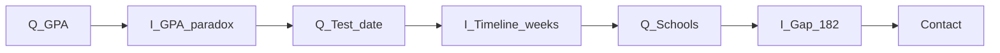

# Funnel master flow — co-mixed Q + I

**Status:** Canonical build order (locked)  
**Detail:** Questions → [`funnel-intake-questions.md`](funnel-intake-questions.md) · Insight copy → [`funnel-interstitials-noom-map.md`](funnel-interstitials-noom-map.md)

---

## The rule (locked — read this first)

| Every screen | One beat only |
|--------------|---------------|
| **Question screen** | Exactly **one** question. Never two questions on one URL. |
| **Insight screen** | Exactly **one** interstitial. Never two insights on one URL. |

**Advance:** Parent taps Continue (or auto-advance on single-select) → **next screen** is **either** the next question **or** an insight — never both on the same screen.

**Reactive placement:** When an answer **unlocks** a specific aha, that insight is the **very next screen** — not deferred until after more questions.

| Allowed | Rejected |
|---------|----------|
| Q → Q → Q → **I** → Q → **I** → Q | Q → Q → Q → Q → **I → I → I** |
| Q → Q when the first Q did **not** unlock an insight | Batching insights after a “diagnosis block” |
| **I** immediately after the Q that triggered it | “Ask GPA, score, wrong, hours, **then** show 3 interstitials” |
| **Never I → I** | Two insight screens in a row without a question between |

**Exception (2026-05):** When `prep_class` or self-study prep is selected, **INT8 trilogy** — `prep-failed-plateau` → `prep-failed-proof` → `prep-failed-guided` — before intake continues. Famous-pairs mentors step removed until auto-play (not tap-through). Other prep → single `prep-failed-stub`. `history_none` skips prep → INT8 stub.

**Contrast art:** Girl triptych when who = **daughter** or **Me**; son/other use default strip. See [`funnel-contrast-assets.md`](funnel-contrast-assets.md).

**Examples (your model):**

| They just answered… | **Next screen** (not later) |
|---------------------|----------------------------|
| **GPA** | Why **smart kids with high GPAs** often struggle on the SAT (**INT2** / GPA paradox) |
| **Prep** = Khan / books | Why that prep **stalled** — **2-sigma** / 1:1 vs self-serve (**INT8** `prep_khan` / `prep_books`) |
| **Test date** | **{weeks}** / **{days}** until exam + what’s **typical** for that runway (**INT6-timeline**) |
| **Worries** *(pain)* | *(optional)* micro-mirror only — see **INT1 placement** below |
| **Target** *(after who + goal)* | **INT1** — moms like you + **pain_clause** + custom plan → **{target}** |

Not every question gets an insight. When there’s no unlock, **next screen = next question**.

---

## Reactive map — tested path

| # | Screen | Type | `?step=` | Unlocks next… |
|---|--------|------|----------|---------------|
| 1 | What’s got you worried? | **Q** | `worries` | → 2 |
| 2 | Who’s taking the SAT? | **Q** | `who` | → 3 |
| 3 | Target score | **Q** | `target` | → **4 INT1** |
| 4 | You’re in good hands *(mirror `worries[]` + `{target}`)* | **I** | `trust` | → 5 |
| 5 | Taken PSAT/SAT before? | **Q** | `history` | → 6 (tested) or **6′** (never) |
| 6 | How did {subject} prepare? | **Q** | `prep` | → **7 INT8** |
| 7 | Why that prep stalled *(variant by `prep_*`)* | **I** | `prep-failed` | → 8 |
| ~~8~~ | ~~Hours studied~~ | — | ~~`hours`~~ | **Removed** — INT8 → score or INT13 |
| 9 | Most recent score | **Q** | `score` | → 10 |
| 10 | What went wrong? *(multi)* | **Q** | `wrong` | → 11 |
| 11 | GPA | **Q** | `gpa` | → **12 INT2** |
| 12 | Smart kid / GPA–SAT gap | **I** | `gpa-paradox` | → 13 |
| 13 | When take / retake? | **Q** | `test-date` | → **14 INT6-timeline** |
| 14 | **{weeks}** until test · typical plan for that timeline | **I** | `timeline` | → 15 |
| 15 | Target schools *(Skip OK)* | **Q** | `schools` | → **16 INT6-prediction** |
| 16 | **{gap_pts}** gap · **182 avg** · path graph | **I** | `plan-path` | → 17 |
| 17 | Email + phone | **contact** | `contact` | → 18 |
| 18 | Plan ready | **I** | `plan-ready` | → 19 |
| 19 | Report | **report** | `report` | |

**Optional extra insights** — each must sit **directly after** the Q that triggers it, never back-to-back with another I:

| Insert after Q | **I** | Notes |
|--------------|-------|--------|
| `wrong` (timing / format picks) | **INT12** Digital SAT | `showIf` on wrong ids |
| `prep_own_nothing` | **INT13** Kid problem | or fold into INT8 |
| Before contact (only if 2-sigma not in INT8) | **INT9** Why guided | prefer merging into INT8 / INT6 |

**Conditional next-screen (same rule — still immediate after triggering Q):**

| After Q | Next **I** | `showIf` |
|---------|------------|----------|
| History | **INT3** retake reality | **`history_twice` / `history_three_plus` only** — prior SAT attempts; **`stuck_score` worry = planning retake → INT1 only** |
| Prep | INT8 variant | `prep_class` → group-class copy; `prep_khan` → Khan + **2-sigma**; `prep_books` → Blue Book / dusty book |
| Wrong | **INT5** weakness-first | optional flag — only if next would otherwise be Q and copy team wants it |
| GPA | INT2 | always after GPA on tested path; lighter **INT7** slice if GPA high + score low trigger false |
| Contact | **INT10** share | `showIf`: not `test_taker_self` |

**Trim for MVP:** Drop optional inserts; merge **2-sigma** into INT8 after prep; keep **12 → 14 → 16** as the reactive insight chain (GPA · timeline · gap+182).



---

## INT8 after prep — one screen, one variant

Single interstitial row in spine; **body copy branches** on `prep_*`:

| `prep_*` | Next-screen job |
|----------|-----------------|
| `prep_khan` | Free ≠ personalized; **2-sigma**: 1:1 targets **their** misses |
| `prep_books` | Blue Book / tests without a **system** — busy, not better |
| `prep_class` | Overview on what they know; no 1:1 on misses |
| `prep_tutor` | Hours without diagnostic + Digital full tests |
| `prep_own_nothing` | Light INT13 tease or skip to hours |

---

## INT6 split — two screens, not one lecture

| Screen | When | Job |
|--------|------|-----|
| **INT6-timeline** (`timeline`) | **Immediately after test date** | “**{days}** days · **{weeks}** weeks until **[date]**.” What a **typical** guided plan looks like for **that** runway (hrs/week band — not a guarantee). |
| **INT6-prediction** (`plan-path`) | **After schools** (or before contact) | “**{gap_pts}-point** gap.” Completers **avg 182** over **12 weeks**. Path graph → contact. |

Do **not** combine timeline + gap + 182 + graph on one screen if it reads like three interstitials crammed together — split across **14** and **19**.

---

## Never-tested path (`history_none`)

Skip prep, hours, score, wrong, INT8, INT3.

| # | Screen |
|---|--------|
| 1 | Q worries |
| 2–3 | Q who · Q target |
| 4 | **I INT1** trust |
| 5 | Q history → neither |
| 6 | Q GPA |
| 7 | **I** high-ceiling / smart kid *(INT7 — no score yet)* |
| 8 | Q test date |
| 9 | **I INT6-timeline** |
| 10 | Q schools |
| 11 | **I INT6-prediction** *(softer — no `{gap_pts}` from score)* |
| 12–14 | contact · INT11 · report |

---

## MVP spine (minimum)

One Q or one I per screen; reactive inserts only:

```
Q worries → Q who → Q target → **I INT1**
→ Q history → [I INT3 if retake trigger]
→ Q prep → I INT8
→ Q hours → Q score → Q wrong → Q gpa → I INT2
→ Q test-date → I timeline
→ Q schools → I plan-path (gap + 182)
→ contact → I INT11 → report
```

No **I → I → I** block in MVP.

---

## Router (Illuminairy)

```ts
// Each row = one screen. After advance, render spine[i+1] only.
{ type: 'q', stepId: 'gpa' },
{ type: 'i', stepId: 'gpa-paradox', beat: 'INT2' },      // always next after gpa (tested)
{ type: 'q', stepId: 'test-date' },
{ type: 'i', stepId: 'timeline', beat: 'INT6-timeline' }, // always next after test-date
```

- **`showIf`** on a row skips it and advances to the following row (still one beat per screen).
- Branch at **history**: swap in never-tested sub-spine from row 6 onward.
- Analytics: `funnel_seq`, `beat_type` (`q` | `i`), `beat_id`, `triggered_by` (prior `stepId`).

---

## INT1 placement — when to say “good hands”

**Default (recommended):** **After Who + Target** — seq 4, immediately after target Q.

| | After **worries only** | After **who + target** *(default)* |
|--|------------------------|-------------------------------------|
| **Feels like** | Pitch before they’ve shared context | Checkpoint after they’ve invested + named a goal |
| **Personalization** | “Your student” only | **{daughter/son/you}** + **{target band}** |
| **Proof (1450+, 182, N families)** | Often reads **salesy** | Reads as “we do this for goals like yours” |
| **Mirror worries** | Natural timing for pain | Still works — store `worries[]`, echo on INT1 |

**Why not right after pain:** They’ve only picked worry tiles. Jumping to mentors / program stats can feel like Meta ad → landing page → **instant credibility flex**. Better: **3 short asks** (pain, who, goal) → **one** trust beat → diagnosis.

**A/B option (mirror-only early):** After worries, **one line** on the Continue transition or a **4-second** full screen with **mirror only** — no stats, no program name. Proof stays on post-target INT1. Only run if drop-off between worries and who is high.

**After target:** optional **toast** on target Q itself (“Good — we’ll map a path to [band]”) is enough if INT1 follows on the **next** screen.

---

## Build queue

| Seq | Doc | Status |
|-----|-----|--------|
| 1 | [screen-01-worries.md](screens/screen-01-worries.md) | ✅ |
| 2 | [screen-02-who.md](screens/screen-02-who.md) | ⬜ next |
| 3 | target | |
| 4 | [screen-int1-trust.md](screens/screen-int1-trust.md) | after **who + target** |
| … | alternate per table above | |

Deprecated: combo score/GPA/retake specs · insight **blocks** after Q runs.
