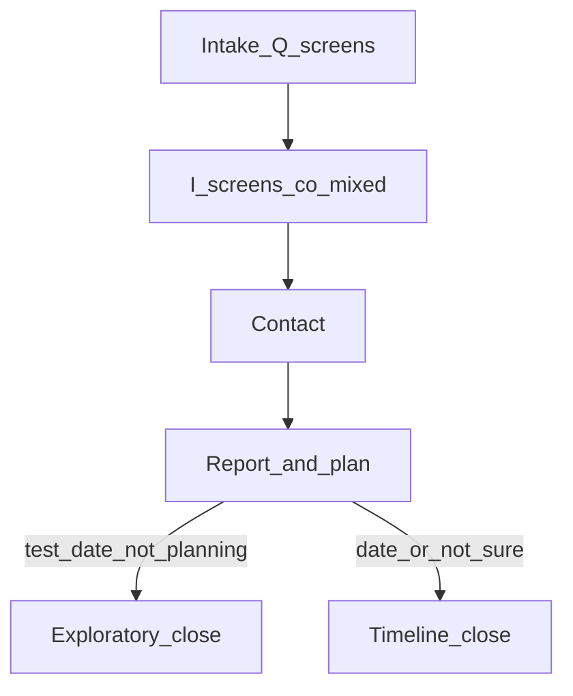

# Funnel intake — question flow (no interstitials)

**Status:** Product draft  
**Scope:** Questions only — no chapter dividers, insight screens, report, or phone capture.  
**Pattern:** One question per step · single-select → auto-advance (grayed Continue) · multiselect where noted (enabled Continue).  
**Personalization:** After Step 2, copy uses **daughter / son / you / they**. **No child name** on intake.

---

## Locked product decisions

| Decision | Choice |
|----------|--------|
| **Goal before current score** | Target score (Step 3) **before** test history and recent score. Pain → who → **goal** → diagnosis. Do not reorder to “current first.” |
| **Goal-first rationale** | Meta / Heyflow-style funnels perform when the path feels **goal-oriented**. Pain (Step 1) opens the conversation; target (Step 3) **locks an aspirational number** so later questions read as *“how do we get there?”* not *“rate where you are.”* |
| **What went wrong** | v4 **multiselect only** — no follow-up “main reason” screen (extra tap, minimal lift for interstitials). |
| **How they prepped** | **Multiselect** — select all that apply; enabled Continue. |
| **Test date** | **Not sure yet** + **date-aware upcoming list**; **Not planning** = same funnel, **report tone variant** (exploratory anchor + optional call, not hard sell). |
| **Grouping** | One question per funnel step — no combined URLs. |
| **Insight placement** | **Reactive co-mix** ([`FUNNEL-MASTER-FLOW.md`](FUNNEL-MASTER-FLOW.md)) — one Q **or** one I per screen. When an answer unlocks an aha, **next screen** is that I (e.g. GPA → smart-kid I; prep Khan → 2-sigma I; test date → timeline I). **Never** stack multiple I screens after several Q screens. |

---

## Step 1 — Pain *(built: `worries`)*

**What’s got you worried?** *(multiselect · enabled Continue)*

| Label | `id` |
|-------|------|
| Recent score | `recent_test` |
| Upcoming test | `upcoming_not_ready` |
| Below range | `target_schools_low` |
| App deadlines | `early_deadlines` |
| Planning to retake | `stuck_score` |
| Haven’t started | `not_prepped` |

---

## Step 2 — Who

**Who’s taking the SAT?** *(single select · auto-advance)*

| Option | `id` | Copy after this |
|--------|------|-----------------|
| My daughter | `test_taker_daughter` | your daughter / she / her |
| My son | `test_taker_son` | your son / he / his |
| Me | `test_taker_self` | you / your |
| Someone else | `test_taker_other` | they / their |

---

## Step 3 — Target score *(goal-first)*

**What score is {subject} aiming for?** *(single select · auto-advance)*

Pronoun after Step 2: *she* / *he* / *you* / *they*.

| Option | `id` |
|--------|------|
| 1200–1300 | `target_1200_1300` |
| 1300–1400 | `target_1300_1400` |
| 1400–1500 | `target_1400_1500` |
| 1500+ | `target_1500_plus` |
| Not sure yet | `target_not_sure` |

---

## Step 4 — Test history

**Has {subject} taken the PSAT or SAT before?** *(single select · auto-advance)*

| Option | `id` | Branching |
|--------|------|-----------|
| No — neither PSAT nor SAT | `history_none` | Skip Steps 5–8 |
| PSAT only | `history_psat_only` | Steps 5–8; Step 7 label = PSAT |
| Once | `history_once` | Steps 5–8 |
| Twice | `history_twice` | Steps 5–8 |
| Three or more times | `history_three_plus` | Steps 5–8 |

---

## Step 5 — How they prepped *(conditional)*

**Shown only if** Step 4 ≠ `history_none`.

**How did {subject} prepare last time?** *(multiselect · enabled Continue)*  
*Select all that apply — e.g. Khan plus a tutor.*

| Option | `id` |
|--------|------|
| Khan Academy | `prep_khan` |
| Bluebook | `prep_bluebook` |
| YouTube | `prep_youtube` |
| Group class in person | `prep_class` |
| An app | `prep_app` |
| Not sure | `prep_not_sure` |
| Didn't prepare | `prep_didnt_prepare` |

---

## Step 6 — Recent score *(conditional)*

**Shown only if** Step 4 ≠ `history_none`.

**What was {possessive} most recent {PSAT/SAT} score?** *(single select · auto-advance)*

| Option | `id` |
|--------|------|
| Below 1000 | `score_below_1000` |
| 1000–1100 | `score_1000_1100` |
| 1100–1200 | `score_1100_1200` |
| 1200–1300 | `score_1200_1300` |
| 1300+ | `score_1300_plus` |

---

## Step 7 — What went wrong *(conditional)*

**Shown only if** Step 4 ≠ `history_none`.

**What do you think went wrong? (Select all that apply)** *(multiselect · enabled Continue)*  
*No follow-up “main reason” step.*

**Time**

| Label | `id` |
|-------|------|
| Ran out of time | `wrong_time_ran_out` |
| Rushed and guessed at the end | `wrong_time_rushed` |
| Got stuck on hard questions too long | `wrong_time_stuck` |

**Focus**

| Label | `id` |
|-------|------|
| Lost focus during the test | `wrong_focus_lost` |
| Mentally exhausted before it was over | `wrong_focus_exhausted` |

**Anxiety**

| Label | `id` |
|-------|------|
| Froze or panicked | `wrong_anxiety_froze` |
| Second-guessed answers | `wrong_anxiety_second_guess` |
| Knows the material but couldn’t perform | `wrong_anxiety_couldnt_perform` |

**Content**

| Label | `id` |
|-------|------|
| Struggled with math topics | `wrong_content_math` |
| Struggled with reading passages | `wrong_content_reading` |
| Struggled with grammar questions | `wrong_content_grammar` |
| Questions worded differently than school | `wrong_content_wording` |

**Prep**

| Label | `id` |
|-------|------|
| Didn’t take full-length practice tests | `wrong_prep_no_full_tests` |
| Only studied a few days/weekends | `wrong_prep_cramming` |
| Didn’t know what to expect | `wrong_prep_unprepared` |

- Require ≥1 selection to enable Continue.
- UI: category headers (Time, Focus, Anxiety, Content, Prep) — same as v4 Screen 5.
- Interstitial Screen 6 Section B branches on **`wrong_*` array**; if multiple selected, show multiple blocks (no single “main” required).

---

## Step 8 — GPA

**What’s {possessive} GPA?** *(single select · auto-advance)*

| Option | `id` |
|--------|------|
| Below 3.0 | `gpa_below_3` |
| 3.0–3.5 | `gpa_3_3_5` |
| 3.5–3.8 | `gpa_3_5_3_8` |
| 3.8–4.0 | `gpa_3_8_4` |
| 4.0+ | `gpa_4_plus` |

---

## Step 9 — Retake / test date

**When is {subject} planning to take {or retake} the SAT?** *(single select · auto-advance)*

### Option groups (display order)

1. **Upcoming test dates** — dynamic subset (see below)
2. **Not sure yet** — keeps non-committal parents in the **main** funnel (same plan path; timeline copy uses ranges, not a named exam)
3. **Not planning to retake / take** — **same intake path**; report/plan close uses **exploratory copy** (what reaching their target would take *if* they decide) + optional book-a-call — not a hard accelerator push

### Meta options (always shown)

| Option | `id` | Routing / report |
|--------|------|------------------|
| Not sure yet | `test_date_not_sure` | **Main report** — generic timeline; no named exam in headline |
| Not planning to retake / take | `test_date_not_planning` | **Same funnel through schools + interstitials** — report emphasizes **exploration**: anchor on target score (“if {subject} decided to go for {target}, here’s what it would take”) + soft CTA to book a call if interested; no urgency / enrollment close |

### Exam options (date-aware)

Show only **upcoming** administrations from the canonical list (hide past dates and dates inside minimum lead time, e.g. &lt; 4 weeks out — tune at build).

**Fall-prep funnel (default for Aug 2026 program traffic):**

| Label | `id` | Notes |
|-------|------|-------|
| August 2026 SAT | `test_date_aug_2026` | Aligns with [`lib/site.ts`](../../Illuminairy/lib/site.ts) / `SAT_EXAM_DAY` **2026-08-22** |
| October 2026 SAT | `test_date_oct_2026` | |
| November 2026 SAT | `test_date_nov_2026` | |
| December 2026 SAT | `test_date_dec_2026` | |

**Early-prep branch (year-round / spring traffic):** add when ads or organic run outside fall cohort:

| Label | `id` |
|-------|------|
| March 2026 SAT | `test_date_mar_2026` |
| May 2026 SAT | `test_date_may_2026` |
| June 2026 SAT | `test_date_jun_2026` |

### Date-aware rules (build)

- **Single source of truth:** new helper e.g. `lib/sat-test-dates.ts` in Illuminairy (exam ISO date + label + `id` + optional `cohort: 'spring' | 'fall'`). Do not hardcode only in funnel UI.
- **Filter at render:** `options = ALL_DATES.filter(d => d.examDay >= today + MIN_LEAD_DAYS)` plus meta rows above.
- **Campaign toggle (optional):** `?cohort=fall2026` shows fall set only; omit or `year_round` includes spring rows when still upcoming.
- **Personalization:** selected exam drives weeks-until-test math in interstitials (v4 Ch. 3 timeline). `test_date_not_sure` → omit named date in headline or use “your next SAT.”
- **Verify** all exam days against College Board before each admissions cycle.



**Co-mixed spine (Q and I interleaved):** [`FUNNEL-MASTER-FLOW.md`](FUNNEL-MASTER-FLOW.md)

*Copy tweak:* if Step 4 = `history_none`, headline = “When is {subject} planning to **take** the SAT?” (no “retake”).

---

## Step 10 — Schools *(open design)*

**What schools is {subject} considering?** *(text · Continue or Skip)*

- Free-text; **Skip** recommended for v1.
- Tier picker alternative TBD in design.

---

## Flow summary

**Q-only steps** (question copy above). **Full co-mixed order** (Q + I interleaved): [`FUNNEL-MASTER-FLOW.md`](FUNNEL-MASTER-FLOW.md).

```
Q: 1 Pain → 2 Who → 3 Target → 5 History → [tested: 6 Prep → 8 Hours* → 9 Score → 10 Wrong → ] 11 GPA → 16 Date → 17 Schools
I: inserted between Q rows per master flow (e.g. INT1 after Target, INT8 after Prep, INT7 after GPA, …)
```

---

## Intentionally excluded

| Item | Reason |
|------|--------|
| Child’s first name | No early typing; pronouns from Step 2 |
| “Main reason” follow-up after what went wrong | Extra tap; multiselect enough for interstitials |
| Prep multiselect | ~~Slows tap rhythm; single main method~~ → **multiselect** with Continue (2026-05) |
| Grouped screens | One question per step |
| School tier pick (for now) | Parents may not know buckets |

---

## After intake questions (data model)

Individual **Q steps** are listed above. **Insight (I) steps** are interleaved per [`FUNNEL-MASTER-FLOW.md`](FUNNEL-MASTER-FLOW.md) — not a separate phase after Step 11.

Interstitials consume (as collected): `worries[]`, `test_taker`, `target_*`, `history_*`, `prep_*`, `score_*`, `wrong_*[]`, `gpa_*`, `test_date_*`, schools (optional).

**Full interstitial map (Noom → SAT):** [`funnel-interstitials-noom-map.md`](funnel-interstitials-noom-map.md) — trust, GPA gap, retake reality, 4.4× prep bar, weakness-first method, “last prep” prediction, contact gate.

Legacy long-form copy: v4 Screen 6 Sections A–C; Screens 10–15.

**Report close variants by `test_date_*`:**

| Value | Close behavior |
|-------|----------------|
| Specific exam | Named date, weeks-until-test math, accelerator-fit CTA (v4 Ch. 3–4) |
| `test_date_not_sure` | Generic timeline; “when you choose a date…” |
| `test_date_not_planning` | Target-score anchor only (“if you decided…”); exploratory tone; book-a-call optional — no enrollment pressure |

---

## Supersedes

v4 grouped intake screens, legacy Screen 02 combined specs, variant A/B wizard-on-one-URL docs.
