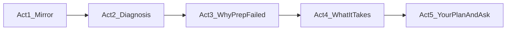
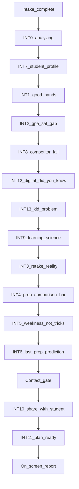

# Interstitials — Noom patterns → SAT (Illuminairy)

**Status:** Product / copy draft  
**Scope:** Trust and education beats **woven into** the funnel ([`FUNNEL-MASTER-FLOW.md`](FUNNEL-MASTER-FLOW.md)) — **co-mixed** with intake questions, not batched after Step 11. One beat per screen: **input or insight**, never both.  
**Build:** Each insight is a router step with `showIf` triggers; flags per beat for MVP thinning.

**Rhythm (locked):** **One beat per screen** — one question **or** one interstitial. When a question unlocks an aha, that insight is the **immediate next screen** (GPA → smart kid; prep Khan/books → 2-sigma / INT8; test date → weeks/days timeline). **Never** Q×4 then I×3. See [`FUNNEL-MASTER-FLOW.md`](FUNNEL-MASTER-FLOW.md).

Noom reference screens saved 2026-05-23 in workspace `assets/Screenshot_2026-05-23_*`.

---

## Narrative goal — consultative “sales call in product form”

The interstitial block is **not filler between questions**. It is the **consultation** a sharp rep would give on a discovery call: educate, deliver insight the parent **appreciates**, and let the next step feel obvious — not pressured.

### Assume a burned buyer

**Most parents have already tried something** — Khan, a class, a tutor, books, or “on their own.” Step 5 (`prep_*`) captures which. Even `prep_own_nothing` often means passive exposure (school PSAT, one practice test). **Do not talk down to them** — validate effort, then explain **why that category of solution couldn’t work** for a score like {possessive}, not why they picked wrong.

**Strategic outcome:** By report/contact, generic alternatives **shouldn’t add up** anymore. The mom can **scrutinize competitors** with the same lens we taught her — format mismatch, no diagnostic, middle-of-room, paper prep — without us naming brands or trash-talking. Trust comes from **demonstrated understanding**, not superiority claims ([`illuminairy_brand_kit_brief.md`](illuminairy_brand_kit_brief.md)).

### Voice & tone — positive, educated, obvious (not macho)

**We don’t rip apart competitors.** We name **patterns** and **parent experiences** parents already lived — then let the conclusion feel inevitable. If we’re better, it should be **obvious from the facts**, not from swagger.

| Do | Don’t |
|----|--------|
| Neutral, cited **data** and **plain observations** | Flex stats, “crush the competition,” dunking on Khan/classes/tutors |
| **Validate** prior choices (“that was a reasonable start”) | Shame the kid, the parent, or a provider they liked |
| Name the **dusty book / open Khan tab** moment — disarming because it’s true | Attack brands, price-shame tutors, “strip mall” insults in UI |
| Explain **structure** (diagnostic, plan, accountability) calmly | Macho superiority (“we’re the only ones who…”) |
| One **aha** + one **fact** per screen | Stack claims like a sales deck |

**Claims rule:** Every number earns **one** realization — footnoted, matter-of-fact, like a good tutor explaining the test, not a infomercial.

**Banned phrases (customer-facing funnel copy):** Do not use **jump** or **real** as hype intensifiers. Do not use **meaningful** — it says nothing; use **`{gap_pts}`**. See **Authoritative voice** for hedging bans (**most**, **some**, **usually**, etc.).

| Avoid | Prefer |
|-------|--------|
| jump, real jump, score jump | See **parent voice (scores)** below — never vague “move the score” |
| real (modifier) | **actual**, **official**, **on test day**, **full** — or drop it; **not** “meaningful” when you have a number |
| meaningful (score copy) | **{gap_pts} points** from intake — e.g. “improve her score by **150 points**” |
| the real test | **the Digital SAT on exam day**, **test day** |
| real diagnostic | **diagnostic up front**, **formal diagnostic** |
| real score report | **score report** from a timed practice or official test |
| real deadline | **exam date**, **their test date** |

**Parent voice (scores)** — plain language moms use; **always personalize** with intake data:

| Pattern | Example |
|---------|---------|
| Default | “**get {possessive} score up**” |
| With number | “**improve {possessive} score by {gap_pts} points**” |
| Noun form | “a **{gap_pts}-point** score gain” |

**`{gap_pts}`** = derived from Step 3 `target_*` minus Step 7 `score_*` (band midpoint or conservative estimate; document in Illuminairy router). Show the **parent’s number** (e.g. 150), not “meaningful improvement.”

**Cramming line:** Say **“a few weekends of cramming”** — not “one weekend” / “a cram weekend.”

### Authoritative voice (customer-facing UI only)

**Sound like a tutor who has seen this a hundred times** — direct, specific, **their numbers**. Not sales hedging.

| Banned in UI copy | Why | Use instead |
|-----------------|-----|-------------|
| **meaningful** | Empty word — says nothing | **`{gap_pts} points`** from intake |
| **most**, **many**, **some** | Weakens the claim | State the fact or put range in **footnote** |
| **usually**, **often**, **commonly** | Wishy-washy | **“It takes…”**, **“That requires…”**, **“The test rewards…”** |
| **typical** (unqualified) | Vague | **“Program completers average…”** + completion qualifier |
| **families like yours**, **most families** | Soft sell | **{subject}**, **{possessive}**, **your answers** |
| **it’s common that…** | Distance from the parent | **“When the score band hasn’t moved…”** (observation, not statistic about “most”) |

**Pattern:** Lead with **what it takes for {subject}** — `{gap_pts}`, `{weeks}`, `{hours_per_week}` — not what “most people” do.

**Footnotes / disclaimer strips** may cite research ranges (“College Board reports…”) — **headlines and body beats do not hedge.**

**Target feeling at report/contact:**  
*“That’s **why smart kids struggle** on this test. That’s **why what we tried didn’t work**. That’s **what it takes to improve the score** — and I can see **why the research says so**. Another generic class wouldn’t fix this.”*

**Internal spec prose** (this doc, checklists) may still use analytical hedging when describing categories — **do not port that phrasing to UI.**

### Four-part education (every full spine must cover all four)

| # | Teach | Parent should be able to say… | Beats | Research / data (footnote before prod) |
|---|--------|-------------------------------|-------|----------------------------------------|
| **A** | **Why smart kids struggle** | “High GPA doesn’t mean SAT-ready — different skills, timed digital format.” | INT2, INT7 | CB grade–test mismatch; school vs SAT cognitive profile |
| **B** | **Why prior prep didn’t work** | “We weren’t lazy — that **method** can’t diagnose **their** gaps or train for **test day**.” | INT8, INT12, INT3 | Generic class/self-study structure; Digital SAT vs paper; ~40 pt retake w/o new approach |
| **C** | **What actually works** | “Guided 1:1 on **their** weaknesses, Digital-native reps, **Y** weeks of focused hours.” | INT9, INT4, INT5, INT6 | 2-sigma; weakness-first; CB ~80 hr → 200+ pt band; hours × weeks from intake |
| **D** | **How we know** (woven in, not a lecture) | “This isn’t opinion — College Board + learning science + score patterns.” | Footnotes on INT9, INT4, INT6; optional INT1 credentials | Bloom; CB; internal cohort with “results vary” |

**Differentiation rule:** Teach **categories** (self-study, group class, paper prep, **generalist / independent tutor**) — never competitor names. Illuminairy emerges as the **logical fit** after the math, not the opening claim. **Tone:** diagnose the *category*, not the person — no price shaming (“cheap tutor”) or insulting a specific provider the family liked.

**Trust rule:** If our analysis of **their** answers (profile, prep choice, gaps) is accurate, the sale is mostly done. Stats support the story; **personalization proves we listened**.

### Two parent questions (shorthand for copy QA)

Every stat must answer **(1)** or **(2)** — not decorate a pitch:

| Parent question | Maps to education parts | Beats |
|-----------------|-------------------------|-------|
| **Why didn’t they do well the first time?** | **A + B** | INT2, INT7, INT8, INT12, INT3 |
| **What does it actually take to do well?** | **C + D** | INT9, INT4, INT5, INT6 |

**Rule:** If a beat doesn’t advance **A, B, C, or D**, cut it. Lead with *“This is why…”* not *“We are…”*

### Aha ↔ data pairings (canonical — one number earns one realization)

**Principle:** Data **diagnoses**, it doesn’t flex. Each interstitial = **one aha** + **one anchored stat** (footnote before prod). By the email gate, mom thinks like a **tutor** — not a shopper reading ads.

| Mom’s aha | Data that earns it | Beat | Screen (Illuminairy)* |
|-----------|-------------------|------|------------------------|
| **“Generic prep is the wrong tool.”** | 2-sigma (Bloom): 1:1 ≈ **98th percentile** of typical classroom instruction | INT8 / INT9 | TBD |
| **“Group class wastes time on what she already knows.”** | Survey-style classes: **no diagnostic** — hours on mastered topics, **no 1:1** on misses; overview ≠ fix | INT8 (`prep_class`) | TBD — see INT8 group-class block |
| **“We already had a tutor — why didn’t it work?”** | Many independent tutors: **no diagnostic**, no **full-length timed Digital** reps; often **never sat for the current test** | INT8 (`prep_tutor`) | TBD — [`screen-int8-prep-tutor.md`](screens/screen-int8-prep-tutor.md) |
| **“A tutor without a plan isn’t accountability.”** | **Personalized plan** + **weekly parent progress reports** — you see the process, not just “we met for an hour” | INT5, INT9 | TBD |
| **“She trained on the wrong format.”** | Digital SAT + built-in tools; **~1.5×** math speed vs paper-only practice *(verify)* | **INT12** | **Screen 7 — [`screen-07-sat-changed.md`](screens/screen-07-sat-changed.md)** · `step=sat-changed` |
| **“Retaking alone doesn’t move the needle.”** | Avg self-retake gain **~20–60 pts** (College Board) | INT3 | TBD |
| **“Practice hours don’t equal score gains.”** | Top scorers study **weaknesses**, not just more hours *(cite)* | INT5 | TBD |
| **“Getting {possessive} score up by {gap_pts} points takes more than a few weekends of cramming.”** | **{weeks} weeks** × **{hours_per_week} hrs/week** on gaps; CB **~80 hrs guided** → **200+ pt** *(footnote)*; completers **182 avg** *(footnote)* | **INT6** | [`screen-int6-time-and-effort.md`](screens/screen-int6-time-and-effort.md) |
| **“Most teens can’t self-run an SAT prep project.”** | Without a plan: **busy**, **distracted**, or studying the **wrong things** — effort ≠ progress | **INT13**, INT6 | **Screen 9** — [`screen-09-kid-problem.md`](screens/screen-09-kid-problem.md) |
| **“We handed her the book — and it gathered dust.”** | Even strong materials need **structure**; self-directed SAT prep rarely sustains *(observation + optional CB retake band)* | **INT13** | **Screen 9** |
| **“A structured 12-week program can move scores — when they finish it.”** | Students who **complete** our **12-week program** average **182 points** gained; some gain **250+** *(internal cohort — footnote)* | **INT6**, INT4, Report | [`screen-int6-time-and-effort.md`](screens/screen-int6-time-and-effort.md) |
| **“Her GPA proves the issue isn’t ability.”** | High GPA + low SAT = **content / test-skills gap**, not intelligence | INT2 | TBD |

\*Intake = Steps 1–11; interstitial screen numbers are **build order** after schools step.

**Sale logic:** Teach **how to think about the problem** → Illuminairy is the **logical conclusion** — inevitable, not pushed.

| Pillar | Parent-facing idea | Typical beat | Source (verify before prod) |
|--------|-------------------|--------------|----------------------------|
| **1. Diagnosis** | High GPA + low SAT ≠ low ability — **school and SAT reward different skills** | INT2, INT7 | College Board grade–test mismatch (~60% mismatch; grades often higher) |
| **2. Why prior prep failed** | **Self-study, group class, and many independent tutors** don’t diagnose gaps; skip **timed Digital** full tests; **paper/book/classroom prep** ≠ Digital SAT format | INT8, INT12, INT3 | ~40 pt retake w/o new approach; format mismatch (see INT12) |
| **3. Why tutoring + personalized wins** | **1:1 guided** (2-sigma) targets *their* misses; generic curriculum wastes hours | INT9, INT4, INT5 | Bloom 2-sigma; weakness-first vs “review everything” |
| **4. What works + how long** | **~XX points** for profiles like theirs needs **~YY hours/weeks** of guided work; **completers** of 12-wk program avg **182 pt**, some **250+** | INT6, INT4 | CB ~**80 hrs guided → 200+ pts**; program outcome stat *(below)* |

**Tone (brand kit):** Show what we see → explain why it happened → lay out what it would take → **then** ask. No countdown scarcity; urgency only from **exam date** (actual deadline, not manufactured).

### Five-act arc (maps beats → emotional job)

| Act | Job | Education parts | Beats | One-line parent takeaway |
|-----|-----|-----------------|-------|--------------------------|
| **1 — Mirror** | “We listened; you’re not crazy.” | — (setup) | INT0, INT7, INT1 | “They get our situation — and our kid’s not broken.” |
| **2 — Smart kid paradox** | “**Why smart kids struggle** on this test.” | **A** | INT2 (+ INT7) | “GPA and SAT measure different things — that explains the gap.” |
| **3 — Prior prep failed** | “**Why what you tried** couldn’t work — without blame.” | **B** | INT8, **INT12**, INT3 | “Structure and format — not laziness.” |
| **3b — The kid problem** | “**Why materials alone** rarely stick — you’ve seen this.” | **B → C bridge** | **INT13** | “The book/Khan tab isn’t the problem — solo follow-through is.” |
| **4 — What it takes + proof** | “**What works** and **how we know**.” | **C + D** | INT9, INT4, INT5, INT6 | “Guided, personalized, Digital-native — the data matches the story.” |
| **5 — Your plan + ask** | Personalized path; fair exchange for report. | — (payoff) | Contact, INT10, INT11, Report | “This plan fits what they just explained — I trust this more than a sales page.” |

**Copy rule:** Each act ends with **one** repeatable sentence. Tag every beat **A / B / C / D** in copy docs. Cut beats that only say “we’re great.”

**Personalization from intake:** Reference `prep_*` in INT8/INT12 (“You said they used **{prep label}** — here’s why that approach stalls…”). Makes **B** feel bespoke, which is the trust lever.

**Chapter labels:** **CHAPTER 1 · WHY SMART KIDS STRUGGLE** (Acts 1–2) → **CHAPTER 2 · WHY PRIOR PREP STALLED** (Act 3) → **CHAPTER 3 · WHAT ACTUALLY WORKS** (Act 4) → **YOUR PLAN** (Act 5). *(Or collapse to two chapters: “Why the score happened” / “What it takes” — A/B vs C/D.)*

---

## What Noom is doing (pattern library)

| Noom screen | Mechanism | SAT analogue |
|-------------|-----------|--------------|
| **2× bar chart** (“twice as much weight…”) | Social proof + visual ratio; footnote cites study | **Score gain ratio** vs self-study (4.4× — needs sourced footnote) |
| **Analyzing / Preparing results** (puzzle icon, 20%→91% bar) | Perceived personalization while showing trust slides | **“Building {name}’s plan…”** between intake end and first insight |
| **Trusted hands** (big number + metaphor art) | Scale + emotional safety | **“You’re in good hands”** + families helped / mentor credentials |
| **Restrictive diet vs Noom curve** | Wrong approach vs right approach (graph) | **Tips/class/generic content vs weakness-first** (graph or two-line comparison) |
| **Sticking to a plan is hard** (testimonial) | Empathy + peer quote + realistic disclaimer | Parent/student quote + **no guarantee** disclaimer |
| **Ideal weight + “Great!”** | Validation after goal entry | After **target score** (Step 3): “Great — we’ll map a path to [target].” |
| **Prediction headline** (“135 lb by Sep 5”) + **“LAST WEIGHT LOSS PROGRAM…”** banner | Aspirational lock-in + timeline graph | **“[Target] by [exam date]”** + **“The last SAT prep plan they’ll need”** (tone: structured path, not hype) |
| **Email gate** (“See my result”) | Fair exchange before reveal | **Contact gate** before full report (email + phone per spine) |
| **CDC / validation block** | Authority when input is unrealistic | **Timeline realism** when target − current > plausible for weeks left (soft redirect, not hard block) |
| **Brand / insurance trust** | Third-party credibility | **Georgia Tech mentors, 1450+ Digital SAT** — optional when trust is thin |
| **Got it / Continue** | Low-friction advance, no new input | Default interstitial CTA — one tap |
| **Yo-yo diet graph** (“restrictive diets often fail”) | Competitor approach fails visually | **Prep class / one-size-fits-all** plateau graph |
| **Psychology / holistic approach** | Method is science-based, not fad | **Learning science + College Board data** |
| **Behavioral profile** (“Intelligent Influencer”) | Positive label from answers — feel seen | **Student prep profile** (one label + 2 sentences) |
| **Accountability buddy** + 32% stat | Share plan; support system data | **Share report with {student}** + decision-making stat |
| **Multi-category analyzing** (62% demographic…) | Labor illusion across plan dimensions | **Analyzing: goals → gaps → timeline** |
| **Minimal “we've created a personalized plan”** | Anticipation beat before reveal | Same before report / after contact |
| **Great job, {name}!** | Micro validation | Optional after profile or share success |
| **“Did you know” fact** | Single surprising stat + analogy | **Digital SAT format** — laptop, built-in tools, paper-prep mismatch |

---

## Recommended SAT interstitial spine (v1.2 — co-mixed)

**Do not run this block as a batch after intake.** Insert beats at the seq positions in [`FUNNEL-MASTER-FLOW.md`](FUNNEL-MASTER-FLOW.md). Order below = **narrative order** when all triggers fire on the **tested path**; router skips rows whose `showIf` is false.

Order follows **intake answers as they arrive**. Target **~8–12 taps** from first insight to report on MVP shortcut; full co-mixed tested path ~26 screens.

| ID | Beat | Trigger | Noom source |
|----|------|---------|-------------|
| **INT0** | Analyzing / building plan | Always (A/B: minimal vs multi-category) | Puzzle + “Analyzing profile” + category % |
| **INT7** | **Student prep profile** | Always (after INT0) | Intelligent Influencer / behavioral profile |
| **INT1** | Good hands | Always | Trusted hands |
| **INT2** | GPA–SAT gap | GPA ≥3.5 band ∧ SAT &lt;1300 | (v4 Screen 6A) |
| **INT8** | **Self-study / group class fails** (generic prep) | `prep_class` **or** always (softened if tutor) | Restrictive diet yo-yo graph |
| **INT12** | **Did you know — Digital SAT format** | Always (once); **boost** if `prep_books` \| `prep_class` \| `prep_khan` | Noom “Did you know” / education interstitial |
| **INT13** | **The kid problem nobody talks about** | Always (once) — **Screen 9** | Noom “plan is hard” empathy — **positive tone** |
| **INT9** | **Why tutoring works** (learning science + CB) | Always (once per funnel) — **first affirmative beat** after INT13 | Psychology / holistic approach |
| **INT3** | Retake reality | **`history_twice` / `history_three_plus` only** — past sittings, not `stuck_score` worry | (v4 prep issues) |
| **INT4** | 4.4× vs self-study bar | Self-study prep ids | 2× bar chart |
| **INT5** | Weakness-first method | Always | Long-term results graph (method) |
| **INT6** | Last prep + prediction | Needs `target_*` + date variant | Last program + Aug 11 graph |
| **Contact** | Parent email + phone | Always (spine) | See my result email gate |
| **INT10** | **Share with student** | Optional step; skip if `test_taker_self` | Accountability buddy + 32% |
| **INT11** | **Plan ready** (micro) | Always | “we've created a personalized plan” |

**MVP shortcut:** INT0 → INT7 → INT1 → INT6 → Contact → INT11 → Report (add education beats when metrics justify length).

---

## Beat copy — draft angles

### INT0 — Analyzing / building your plan

**Purpose:** Labor illusion — parent feels answers are being synthesized, not canned.

**Variant A — Minimal (3–5s, auto-advance):**
- Icon: puzzle or constellation (sparkle)
- Text: “Analyzing {possessive} responses…”
- Optional second beat: “Building {possessive} plan…” *(minimal serif, lowercase — Noom “we've created a personalized plan”)*

**Variant B — Multi-category (Noom “Analyzing Demographic Profile”):**
- Headline: “Building {possessive} SAT improvement plan”
- Progress bar + labeled rows animating 0% → 100%:
  1. **Goals & timeline** (`target_*`, `test_date_*`)
  2. **Starting point** (`score_*`, `gpa_*`, `history_*`)
  3. **Prep & gaps** (`prep_*`, `wrong_*[]`)
  4. **Recommended focus** (derived)
- Footer: “Using patterns from students with similar profiles — not a generic template.”

**Implementation:** Can auto-advance through INT0 while cycling **one** trust slide underneath, or standalone then Continue.

**CTA:** None (auto) or Continue when animation completes.

---

### INT7 — Student prep profile (positive, not cheesy)

**Purpose:** Noom “Intelligent Influencer” — **one label** that reflects their answers and frames strength + fixable gap.

**Rules (anti-cheese):**
- **Describe a pattern, not a compliment** (“tends to…” not “amazing kid”).
- **Tie to prep implication** — what we’ll do differently.
- **One title + 2–3 sentences max.** No Myers-Briggs vibes.
- Use **{subject}** / pronouns from Step 2; no child name on intake.

**Profile router** *(first match wins; priority order):*

| Profile ID | Label | Trigger (examples) | Copy angle |
|------------|-------|-------------------|------------|
| `profile_thorough` | **The Thorough Achiever** | GPA ≥3.5 band + any `wrong_time_*` or `wrong_anxiety_second_guess` | Cares about getting it right; SAT punishes slow precision — we train **decisions under time**, not “try harder.” |
| `profile_high_ceiling` | **High Ceiling, Untrained Test-Taker** | `history_none` or `prep_own_nothing` + GPA ≥3.5 | Strong school performance; score reflects **SAT-specific skills** they haven’t trained yet — lots of room. |
| `profile_stuck_retaker` | **The Prepared-but-Stuck Retaker** | `history_twice+` + low score band | Put in effort; **wrong format** (generic review, not gap-level work). |
| `profile_class_middle` | **Lost in the Middle of the Room** | `prep_class` + score &lt;1300 band | Did the “right” thing socially; class taught **everyone the same thing** — not their gaps. |
| `profile_tutor_no_system` | **Tutor Hours, No Plan** | `prep_tutor` + score &lt;1300 band | Got **1:1 time** but no **diagnostic**, **timed Digital full tests**, or **trackable plan** — gaps stayed. |
| `profile_anxious_performer` | **Knows It, Freezes on Test Day** | Any `wrong_anxiety_*` | Material is there; **performance under pressure** is the lever — repetition + timed reps. |
| `profile_content_gap` | **Strong Student, Specific Leaks** | Multiple `wrong_content_*` | Not a global weakness — **named topic gaps** we can close one at a time. |
| `profile_default` | **The Focused Improver** | Fallback | Clear target, clear timeline — plan will **prioritize highest point-value fixes first**. |

**UI:** Teal/dark card — “{SUBJECT}'S PREP PROFILE” eyebrow + label + body + “Next steps: we’ll show what to fix first.”

**CTA:** Next / Continue

---

### INT8 — Prep comparison (self-study vs guided 1:1)

**Production (2026-05-23):** Simplified from long per-method blocks → **Noom-style comparison bar** at `prep-failed-stub`:

| Anchor | Source | Value |
|--------|--------|-------|
| Self-study alone | College Board retake research (`satRetakeResearch`) | **~40 pts** avg without new approach |
| Guided 1:1 | Illuminairy completers (`satProgramOutcomes`) | **182 pts** avg |
| Headline ratio | 182 ÷ 40 | **4.6×** (one decimal) |
| Bloom 2-sigma | Footnote only — **mechanism**, not proof of 182 | ~98th percentile vs classroom |

**Copy beats:** (1) mirror `prep_*` selection in one line; (2) bar graphic; (3) stat sentence; (4) Bloom footnote; (5) dual-source footnote + “Results vary.”

**Do not** claim Bloom proves 182 — different studies, different cohorts.

**Legacy spec below** — per-method limitation essays (`prep_class`, `prep_tutor`) deferred; fold strongest lines into mirror only if needed later.

---

### INT8 (legacy) — Self-study and group class fail (generic prep)

**Narrative job (Act 3a):** Explain **why common approaches often plateau** — not laziness or bad parenting, but **missing structure**: diagnostic, plan, Digital reps, visibility between sessions. **Tone:** curious and factual; validate prior choices.

**Mom aha (group class / survey course):**  
*“She’s sitting through a **broad overview** — lots of time on questions she **already** gets, and when she hits one she **can’t** solve, there’s no **1:1** help to fix that exact step. The class moves on. She’s **busy**, not **better**.”*

**Noom model:** “Restrictive diets often fail” yo-yo graph — **problem with the category**, not attacking a brand by name.

**Headline (default):** “**Self-study and large prep classes** often plateau — even when students work hard.”

**Headline (when `prep_class`):** “**Survey-style prep classes** rarely fix a score like {possessive}.”

**Graph (optional):**
- X-axis: Week 1 → Week 12
- **Generic class / Khan / tips track:** up slightly then flat (plateau)
- **Personalized 1:1 track:** steady climb (same visual grammar as INT5)

**Body — group class / survey course** *(when `prep_class` or universal softened version):*

1. **No diagnostic up front** — the class doesn’t know which five question types cost {subject} points, so the syllabus is a **tour of everything**.
2. **Time on the wrong questions** — {subject} spends hours on topics they **already** answer correctly; that feels like progress but **won’t get {possessive} score up**.
3. **No 1:1 on the hard ones** — when {subject} is stuck, the overview keeps moving. They don’t get **engaged, step-by-step help** on the exact miss — so the gap **stays**.
4. **Middle of the room** — pace and content target the **average** student; {subject} is a seat number, not a profile.

**One-line aha for spouse:** *“The class reviewed algebra again; she needed someone to sit with her on **the two geometry types** she keeps missing.”*

**Body — self-study** *(when `prep_khan` \| `prep_books` \| `prep_app_other` \| `prep_own_nothing`):*

1. Covers **everything** equally — no one marks **which question types** cost {possessive} points.
2. **No accountability** on misses — easy to re-watch a video or redo easy problems; hard gaps get avoided.
3. Feels productive (hours logged) but **doesn’t move scores** when the same hidden gaps stay hidden.

**Data anchor (pair with aha — footnote):**
- **2-sigma:** Average 1:1 tutoring lands around the **98th percentile** of typical classroom learning — because every minute can target **their** gap, not the median lesson.
- Optional supporting line: **Top scorers don’t study longer** — they study **what they’re weak at** (INT5 preview; don’t duplicate full beat here).

**Bridge to INT12:** “And there’s a second problem most families miss — **the test itself changed.**”

**Trigger emphasis:** Full **group-class block** when `prep_class`; full **independent-tutor block** when `prep_tutor`; self-study block when self-study ids; softened overlap when score still low after any prior prep (“even good intentions fail without **gap-level** plan + **Digital** reps”).

**Body — independent / generalist tutor** *(when `prep_tutor` — validate effort first):*

**Mom aha:**  
*“We paid for help — but most independent tutors don’t run a **diagnostic up front**, don’t assign **full-length timed Digital** practice tests, and often **haven’t taken the current Digital SAT themselves**. There’s **no written plan** — so {subject} shows up, works on whatever feels urgent, and the same gaps never get closed. You’re paying for **hours**, not **accountability**.”*

1. **No diagnostic** — sessions start with “what do you want to work on?” instead of **which question types cost points** on a score report or timed test.
2. **No full-length timed Digital practice** — homework is often worksheets or untimed problems; test day is **75-second decisions on a laptop** — different muscle.
3. **Format mismatch** — tutor may have crushed the **old paper SAT** (or never retested) — Desmos, adaptive modules, and on-screen tools aren’t what they drill.
4. **No plan, no parent visibility** — no week-by-week map of what gets fixed when; mom hears “it went fine” with **no line of sight** into gaps closing.

**One-line aha for spouse:**  
*“The tutor was smart — but there was **no plan**, no **timed digital tests**, and we couldn’t see if geometry was actually getting fixed.”*

**Customer-facing category label:** Describe **patterns** (“survey-style class,” “self-paced app,” “hourly tutor without a plan”) — acknowledge good intentions; diagnose the **model**, not the person.

**Bridge (B → C):** “What works is the opposite: **diagnose first**, **Digital-native reps**, a **written plan**, and **visibility** for parents.” → INT12 (format) if not yet shown, then INT9/INT5.

**Footnote:** No competitor names; categories only — “large prep classes,” “survey-style courses,” “self-paced apps,” “independent generalist tutors.”

**CTA:** Next

---

### INT12 — Did you know: the SAT is fully digital now

**Narrative job (Act 3b):** **Format mismatch** — parent realizes paper/classroom prep is the wrong field. Sets up why **Digital SAT-native tutoring** matters.

**Noom model:** Single-screen “Did you know…” education beat (Noom seeds / holistic fact screens).

**Eyebrow:** **DID YOU KNOW**

**Headline:** “The SAT is **fully digital** now — taken on a **laptop**, not with pencil and paper.”

**Facts (verify wording vs College Board before prod):**
- Built-in **formula reference sheet** and **graphing calculator** (Desmos) on every math question — no bringing your own.
- Students who **practice with the on-screen tools** solve many math items **~1.5× faster** than students who drill on paper with a handheld calculator. *(Existing report draft uses “30–40%”; unify one stat + source.)*
- Strong math students often **skip the built-in calculator** because they “don’t need it” — but **can do it** and **can do it in 75 seconds** are different skills.

**Analogy (signature line):**  
“You wouldn’t train for a **baseball** game on a **football field.**  
Don’t train for a **digital** test in a **classroom with pencil, paper, and a prep book from 2019.**”

**Personalization hooks:**

| Prior prep | Extra line |
|------------|------------|
| `prep_books` | “Paper practice tests don’t teach the **interface** — scrolling, highlighting, Desmos.” |
| `prep_class` | “Many classes still run **paper drills**; **test day** is on a laptop.” |
| `prep_khan` / app | “Apps help — but if {subject} never trains **timed digital reps**, test day still feels foreign.” |
| `prep_tutor` | “Even a strong tutor can stall if there’s **no diagnostic**, **no timed Digital full tests**, and **no written plan** you can track week to week.” |

**Visual (optional):** Split — laptop with SAT UI (calculator panel) vs desk with pencil + thick prep book. Keep on-brand, not clip-art heavy.

**CTA:** Got it / Continue

**Claims:** CB for format facts; **1.5× / 30–40% speed** — **needs internal or published source** before prod headline.

---

### INT13 — The kid problem nobody talks about *(Screen 9)*

**Narrative job (Act 3b → 4 bridge):** Turn **“I’ll buy a prep book and a study schedule”** parents into ready listeners — by naming an experience **every parent has lived**, without attacking books, Khan, or their kid.

**Placement:** **After** prep-failure beats (INT8, INT12) · **Before** first affirmative beat (INT9 “what works”). This is the **empathy hinge** — not competitor takedown, not product pitch.

**Stable step id:** `kid-problem` → `/satplan?step=kid-problem`

**Eyebrow (optional):** **WHAT MOST PARENTS NOTICE**

**Headline:** “The **kid problem** nobody talks about.”

**Subhead (warm, not clinical):** “Even great prep materials usually **don’t work on their own** — and it’s rarely because {subject} ‘doesn’t care.’”

**Opening — name the lived moment (disarming):**
- “You’ve probably done this: bought the **prep book**, opened **Khan Academy**, maybe even printed a **study schedule**.”
- “For a week or two, it looked like progress. Then life happened — and the book sat on the desk, the tab stayed open, and SAT prep became **something {subject} was supposed to do alone**.”
- “That’s not failure. It’s **normal**.”

**Body — why structure matters (neutral facts, no villain):**

1. **SAT prep is a project, not a subject.** School has a bell schedule; SAT prep has **no teacher taking attendance** — unless someone builds one.
2. **Good materials don’t pick priorities.** A book covers everything; {subject} defaults to what’s **easy** or **due tomorrow** (school), not what costs **points on the test**.
3. **Motivation isn’t the bottleneck — clarity is.** Most teens can work hard when they know **exactly what to do today**. “Study for the SAT” is too vague to sustain.
4. **Distraction isn’t moral failure.** Phone, sports, college apps — without a **plan and check-ins**, the hard hour always loses to the urgent hour.

**Optional data anchor (footnote — matter-of-fact, not macho):**
- College Board: retaking **without changing approach** often yields only **~20–60 points** on average — effort without **aimed** structure tends to plateau. *(Same band as INT3; use one cite.)*

**Personalization:**

| `prep_*` | Extra line |
|----------|------------|
| `prep_books` | “The book wasn’t a bad idea — **solo follow-through** is the hard part.” |
| `prep_khan` / app | “Khan is useful — but **open tabs don’t assign Tuesday’s geometry set**.” |
| `prep_own_nothing` | “Starting with free resources is smart — **sustainability** is what separates families who move scores.” |
| `prep_class` / `prep_tutor` | “Even with help, scores stall when there’s **no written plan** between sessions — {subject} still has to execute alone.” |

**One-line aha (repeatable):**  
*“The materials were fine. What was missing was **someone turning ‘study SAT’ into today’s three tasks** — and checking they happened.”*

**Bridge to INT9 (affirmative — light touch):**  
“That’s why **guided prep with a clear plan** works differently — not because {subject} needs to try harder, but because the **project gets managed**.” → Continue to INT9.

**Tone checklist:**
- [ ] No competitor names; no dunking on Khan/books/classes
- [ ] Parent feels **seen**, not sold to
- [ ] Kid feels **capable**, not lazy
- [ ] Claims sound like **a tutor explaining reality**, not a flex

**CTA:** Continue / Got it

**Maps to:** Noom “sticking to a plan is hard” + Jennifer testimonial energy — **education**, not fear.

---

### INT9 — Why tutoring works (learning science + College Board)

**Narrative job (Act 4a):** Answer **“what does it actually take?”** — after Acts 1–3 explained *why the first score happened*, INT9 shows why **guided 1:1 with a system** beats ad-hoc tutoring (not “any warm body with a whiteboard”).

**Noom model:** “Psychology-based approach… identifying thought patterns and building new habits.”

**Headline (default):** “**Personalized tutoring** works when every minute targets **{possessive} gaps** — not the median student.”

**Headline (when `prep_tutor`):** “**The right kind of tutoring** — diagnostic, Digital-native, and planned — is what moves scores like {possessive}.”

**Body — why 1:1 + system (short):**
- **2-sigma problem (Bloom):** One-to-one instruction with immediate feedback dramatically outperforms typical classroom instruction — the tutor sees the **exact step** where {subject} hesitates.
- **Diagnostic first:** Week-one (or intake) diagnostic maps **which question types** cost points — sessions aren’t “what felt hard last night.”
- **Full-length timed Digital reps:** Practice tests on the **same interface** as test day — adaptive timing, Desmos, scrolling — not paper facsimiles.
- **College Board score-report patterns** — where points are actually lost on the **current** test.

**Illuminairy contrast (Act 4 — category, not attack):**  
Our mentors **took the Digital SAT** and meet a high score bar *(align copy with [`lib/site.ts`](../../Illuminairy/lib/site.ts) — currently **1450+**; funnel draft may say 1425+ until facts are updated in one place)*. They’re **SAT specialists** — not generalists juggling five subjects at a strip-mall rate. **One thing, done well:** close **{possessive}** gaps on **this** test.

**Contrast line (ties Acts 3 → 4):** “Self-study, group class, and **hourly tutoring without a plan** can’t do that at scale. A **personalized plan** can.”

**Accountability line (bridge to INT5):** “The plan is what keeps {subject} **on track** — not willpower alone. Parents get **weekly progress reports** so you’re not guessing whether geometry is actually getting fixed.” *(Fact: weekly parent reports — verify wording vs program offer in `lib/site.ts`.)*

**Timeline line (pair with INT6):** College Board research ties **~80 hours of guided preparation** to **200+ point** gains for many students — weeks-to-exam and hours/week from intake should **sanity-check** against that band (not a promise).

**Optional second line:** “Next we’ll map that to **{possessive} specific gaps** and timeline.”

**Visual:** Small diamond/star icon or simple diagram — not cluttered.

**CTA:** Continue

**Brand:** No score guarantees; cite learning science generally; College Board for format/structure and hours-to-gain stats only. Never guarantee a score from mentor credentials alone.

---

### INT10 — Share the plan with {student} (accountability / skin in the game)

**Noom model:** Accountability buddy + “32% faster” stat banner.

**Placement:** **After parent contact** (you have parent email) or **optional fields on contact screen** — A/B both.

**Headline:** “Prep works best when **{subject} has skin in the game.**”

**Stat banner (needs source before prod):**
- “Students who **review their plan with a parent** before committing are **[X]% more likely** to follow through on the first week of practice.”
- Or softer: “Families who **share the diagnostic together** report clearer goals and fewer ‘I didn’t know I was supposed to…’ moments.”

**Ask:** “Want to share {possessive} SAT improvement report with {subject}?”
- Field: **Student email** or **Student mobile** (optional)
- Sub: “We’ll send a copy they can read before your planning call.”

**Success micro (if submitted):** “Great! {Subject} will get the report shortly.” + trophy/thumbs — then Continue.

**Skip:** “Skip for now” — never block report.

**Exclude:** `test_taker_self` — copy becomes “Want a copy sent to your phone?”

**Maps to:** v4 optional student phone on Screen 17 — elevated to intentional beat with **why**.

---

### INT11 — Plan ready (micro beat)

**Noom model:** Full-screen lowercase serif — “we've created a personalized plan”

**Copy:** “We’ve built **{possessive} personalized SAT plan**.” *(or: “Your report is ready.”)*

**Duration:** 1.5–2s auto-advance OR single tap Continue → report scroll.

**Placement:** Immediately before on-screen report reveal (after contact + optional share).

---

### INT1 — You’re in good hands

**Placement:** **After** Who + Target — seq 4 · [`screen-int1-trust.md`](screens/screen-int1-trust.md)

**Job:** Alleviate **their worry** + social proof + **custom plans** → **{target band}** for **{child}** → bridge to diagnosis.

**Lead template:**

> **We’ve helped [N] moms like you [pain_clause] — with custom plans that get their [child] to [target band] on the SAT.**  
> **Let’s figure out what {subject} needs.**

`[pain_clause]` from checked `worries[]` — e.g. **`stuck_score`** (tile: **Planning a retake**) → “**stop worrying about the retake**”. Full table in screen spec.

**`stuck_score`:** **Planning to retake** — forward-looking on INT1 only. **Not** “score wouldn’t budge” *(that’s INT3 when `history_twice+`)*.

**Proof:** `[N]` when verified; else “**parents like you**”. Optional **1450+** mentors · **no 182** here.

**Avoid:** score guarantees; placeholder **XX** in prod.

**CTA:** Continue → **history**

---

### INT2 — GPA–SAT gap (most common + most solvable)

**Trigger:** GPA band ≥ 3.5 and SAT band &lt; 1300 (same as v4 Screen 6A).

**Headline:** “A [GPA band] GPA with a [score band] SAT. **We see this all the time.**”

**Core message:**
- Doesn’t mean they’re not smart — often the opposite.
- School rewards depth and revision; SAT rewards speed and pattern recognition under time pressure.
- **This is one of the most common profiles we work with — and one of the most solvable** when prep targets the right gaps.

**Footnote (v4):** College Board / grade–test mismatch stat — keep sourced, no outcome guarantee.

**CTA:** Continue

**User intent:** Parent feels seen; gap normalized; problem framed as **fixable**, not identity.

---

### INT3 — Retake reality (not hopeless)

**Purpose:** **Authority** + **Aha** + **Trust** (education **B**) — explain why prior attempts stalled **without** making the retake feel pointless.

**Limitation:** Intake does **not** capture first vs second score — use **benchmark + mirror**, not fake personalization.

**Trigger:** `history_twice` \| `history_three_plus` only *(prior SAT attempts — not `stuck_score` worry, which means **planning** a retake on INT1)*

**Headline:** “A new approach to the SAT, not just another retake.”

**Body (intro + chart + tutor paragraph):**
1. **Intro (above chart)** — College Board **250,000+** retakers, ~**40** pt avg on retest; most kids/students rely on videos + practice problems, which isn’t very effective.
2. **Chart** — same ~**40** vs guided bars (visual).
3. **Tutor pivot (below chart)** — diagnose gaps, model example, student works live, practice + mistake review *(voice: your son / daughter / you / they)*.

**Voice:** Plain parent language — **never** “pattern / ceiling / capable of achieving.” Name **practice + videos + gaps**, not abstractions.

**Optional future:** Add intake step “How much did their score change on the last retake?” (bands: none / &lt;30 / 30–70 / 70+) for true personalized delta — **not in v1 intake**.

**CTA:** Continue

---

### INT4 — Gain more points vs self-study (Noom 2× bar)

**Narrative job (Act 4):** Visual answer to **“what does it take?”** — magnitude difference between hoping self-study works vs guided 1:1. Same role as Noom’s “2× weight loss” bar.

**Trigger:** `prep_khan` \| `prep_app_other` \| `prep_books` \| `prep_own_nothing`  
Also show (softened) for `prep_class` if score still low.

**Headline:** “Improve **4.4× more** with guided prep vs. Khan / Bluebook-style self-study alone.”  
*(Replace headline number only when legal/ops signs off on claim.)*

**Visual:** Two bars — short **“On their own”** (tan), tall **“Illuminairy”** (brand accent) with **4.4×** callout.

**Footnote (required):** Cite internal cohort or **2-sigma / tutoring efficacy** study — same role as Noom’s “12 weeks of active users.” **No SAT score guarantees** in headline or footnote body.

**Subcopy (one line):** Self-study doesn’t diagnose *why* they miss questions or hold them accountable to fix one gap at a time.

**Program proof line (optional second line + footnote):** “Students who **complete** our **12-week program** average **182 points** of improvement — some gain **250+**.” *(Same disclaimer block as INT6; do not use in headline without vary language.)*

**CTA:** Continue

**Maps to:** v4 Screen 6C (Khan block) + Noom comparison chart.

---

### INT5 — Personalized plan, not generic curriculum (Illuminairy method)

**Narrative job (Act 4c):** Lock in **why generic fails vs personalized wins** — the plan they’re about to see is **built from their answers**, not a syllabus. **The plan is the accountability engine** — especially vs independent tutors with no map.

**Note:** INT8 = why self-study/class/**generalist tutor** fail; INT12 = format mismatch; INT5 = **what we do instead**. Show INT5 after INT9/INT4 in full spine.

**Headline:** “{Possessive} plan targets **specific weaknesses** — not tricks, not a generic tour of the whole test.”

**Headline (when `prep_tutor`):** “**A written plan** — not just another hour — is what keeps {subject} accountable.”

**Subhead (accountability + parent visibility):**
- **Personalized plan** = ordered list of **which gaps close when**, tied to diagnostic — {subject} always knows **today’s job**.
- **Weekly progress reports for parents** — you see what was assigned, what moved, what’s next. No more “I think the tutor covered reading.”

**Visual:** Two curves (optional):
- **Generic prep / tips:** busy, flat improvement (yo-yo or plateau)
- **Illuminairy:** steady climb as gaps close one-by-one

**Bullets (personalize from `wrong_*[]` when present):**

| If they flagged… | Line |
|------------------|------|
| Time / pacing | “If speed is the issue, we train **timed decision-making** — not more content.” |
| Content math / reading / grammar | “If geometry is the leak, we drill **geometry** — not a full math reset.” |
| Strong section implied (none of above in one domain) | “Sections they’re already strong on get **minimal time** — we don’t pad hours.” |
| Default | “Every hour ties to a **question type** that could **improve {possessive} score by {gap_pts} points** — nothing ornamental.” |

**Anti-patterns (explicit):**
- Not “SAT tips and tricks”
- Not “review all of algebra, all of grammar, all of reading”
- Not equal time on every topic
- Not “just study more” — **wrong-topic study** is how busy kids **feel** productive without moving the score *(pairs with INT6B)*

**Self-study trap line (when `prep_khan` \| self-study \| high `hours_*`):**  
“{Subject} can **look** busy — Khan open, notes highlighted — while still avoiding the **two question types** that cost points. A plan fixes **what** comes first.”

**CTA:** Got it / Continue

**Maps to:** v4 Screen 13 (how we work) — condensed into one Noom-style methodology beat.

---

### INT6 — How long it takes + why solo effort stalls (“last prep plan” + prediction)

**Narrative job (Act 4d / Act 5 open):** Answer **“how much time, really?”** and **“why can’t {subject} just do this on their own?”** — then convert to **their** numbers (target, date, hours/week). Parent should feel the consultation is **complete** before we ask for email.

**Noom models:** Prediction headline + timeline graph; **“Sticking to a plan is hard”** empathy beat (organization / follow-through — not shame).

**Two beats on one screen (or split A→B with Continue):**

---

#### INT6A — How much time score gains actually take

**Derived inputs:** `{gap_pts}` from target − current score bands; `{weeks}` to `test_date_*`; `{hours_per_week}` from timeline math.

**Hero pair (example of a required co-mixed insight — not 1:1 with every Q):**

1. **Gap:** “You’ve got a **{gap_pts}-point** gap to {possessive} goal.”
2. **Proof:** “Students who **complete our 12-week program** improve by an **average of 182 points**.”

Then cramming + timeline on the same screen. Do **not** use “most of our students achieve…” — use **average** + **complete** + footnote (*results vary*).

**Mom aha (personalized — authoritative):**  
*“**Getting {possessive} score up by {gap_pts} points** takes **more than a few weekends of cramming**. It takes **{weeks} weeks** of focused work on the right gaps.”*

**Headline (primary):** “**Improving {possessive} score by {gap_pts} points** takes **more than a few weekends of cramming** — and every hour has to be **aimed**, not random.”

**Supporting line (hours band):** “That’s **{hours_total} guided hours** at **{hours_per_week} hrs/week** — not busywork on topics {subject} already knows.”

**Data anchor (footnote — CB + program):**
- College Board research ties **~80 hours of guided preparation** to **200+ point** gains for many students *(verify exact CB wording before prod)*.
- **Illuminairy program (internal cohort — education part D):** Students who **complete** the **12-week program** average **182 points** of score improvement. **Some students gain 250+ points.**
- **Required disclaimer (always adjacent — never headline alone):** *Results vary. Not all students achieve the average or top outcomes. Past program results do not guarantee future results for any individual student.* *(Align sample size / methodology with [`PLAN-sat-funnel.md`](../PLAN-sat-funnel.md) outcomes language before prod.)*

**Suggested customer-facing lines (UI — pick one primary + footnote):**
- “Students who **complete** the **12-week program** gain an **average of 182 points**.” *(Footnote: program outcomes include gains of **250+ points**; results vary.)*
- Do **not** use “some students,” “typical,” or “when families stick with…” in UI body copy.

**Visual (optional):** Small stat strip under the timeline graph — **182 avg** · **250+ top outcomes** · footnote icon. *(Noom 2× bar grammar — one number earns one realization; pair with INT6A “weeks matter” aha, not a flex wall.)*

**Personalization (from intake):**

| Signal | Line |
|--------|------|
| `hours_30_60` or `hours_60_plus` + low score | “You said {subject} already put in **[hours band]** — the issue isn’t **effort**. It’s **what** those hours targeted.” |
| `hours_under_10` | “There’s still runway — **random** hours won’t beat a **mapped** plan.” |
| Large gap + short timeline | “**{gap_pts} points** in **[Y] weeks** requires **[X] focused hrs/week**. A few weekends of cramming won’t get there — here’s what will.” |

**Visual:** Score-over-weeks line (current → milestones → target) + optional **hours bar** (“~80 guided hrs” reference band, not personalized as promise).

---

#### INT6B — Why solo effort stalls *(summary — full beat on Screen 9 / INT13)*

**Note:** The **organization / dusty book / wrong-things** narrative lives on **[INT13 — Screen 9](screens/screen-09-kid-problem.md)** (positive, parent-lived experience). INT6 may **tease one line** only, or skip 6B if Screen 9 is in spine.

**Optional one-liner here:** “Self-managed prep hits a wall — we cover why on the next screen.” *(Or omit if INT13 always follows INT12 in build order.)*

---

#### INT6 — Prediction + banner (wrap)

**Banner (Noom):** “THE LAST SAT PREP PLAN THEY’LL NEED” *(small caps eyebrow)*

**Headline variants:**

| `test_date_*` | Headline |
|---------------|----------|
| Specific exam | “We predict a path to **[target band]** by **[Month Day]**.” |
| `test_date_not_sure` | “We predict a path to **[target band]** once you pick a test date.” |
| `test_date_not_planning` | “If {subject} decides to go for **[target band]**, here’s what it would take.” |

**Graph:** Constellation path or simple score-over-weeks line (current band → milestones → target) — reuse [`PLAN-sat-funnel.md`](../PLAN-sat-funnel.md) constellation asset.

**Closing insight line (repeatable):** “**{hours_per_week} hrs/week** for **{weeks} weeks** on **{possessive} gaps** gets **{possessive} score up by {gap_pts} points** — not a few weekends of **studying the wrong things**.”

**Bridge to contact:** “We built that path from **your answers** — enter your email to see the full plan.”

**CTA:** Continue → **contact gate** → optional **INT10 share** (student skin in the game) → **INT11** → report

**Maps to:** v4 Screens 10 + 15 + Noom prediction + “plan is hard” empathy.

---

## Micro-beats (optional, lower priority)

| Beat | Noom source | SAT use |
|------|-------------|---------|
| Empathy + testimonial | Jennifer / “plan is hard” | One parent quote after INT1 or INT5 — **or fold into INT6B** (organization / follow-through) |
| Goal encouragement | “Great! We’re excited…” | Immediately **after Step 3 target** (inline hint or 1s toast — not full screen) |
| Insurance / brands | Popular brands | Skip unless real partnership exists |
| Ideal weight CDC block | Hard validation | **Timeline sanity** interstitial if target − current &gt; ~200 and &lt;8 weeks to exam |

---

## Contact gate (Noom email → Illuminairy spine)

**Headline:** “Enter your email to see **{possessive} full SAT improvement plan**.”

**Sub:** “And how we’d get to **[target band]** by **[date or ‘your next test’]**.”

**Optional proof sub-line (below sub, small type):** “Students who complete our 12-week program average **182 points** of improvement — some **250+**. *Results vary.*” *(A/B vs report-only reveal.)*

**Fields:** Parent email + phone (TCPA). **Optional on same screen:** student email/phone (INT10) with stat banner above fields.

**CTA:** See my plan / See my result

**Delivery:** INT11 micro → on-screen report immediately — not email-only.

---

## Data inputs consumed

From intake: `worries[]`, `test_taker`, pronouns, `target_*`, `history_*`, `prep_*`, `hours_*`, `score_*`, `wrong_*[]`, `gpa_*`, `test_date_*`, schools (optional).

**New derived flags for router:**

- `show_gpa_gap` = gpa ≥ 3.5 band ∧ score &lt; 1300 band  
- `show_retake_beat` = `history_twice` \| `history_three_plus` *(not `stuck_score` worry)*  
- `show_prep_compare` = prep in self-study set  
- `show_competitor_fail_emphasis` = `prep_class` (stronger INT8 group-class copy)  
- `show_tutor_fail_emphasis` = `prep_tutor` (stronger INT8 independent-tutor copy)  
- `student_profile_id` = from INT7 router table  
- `report_tone` = standard \| exploratory (not_planning) \| generic_date (not_sure)

---

## Program outcome stat (canonical — education part **D**)

**Use after trust beats (Act 4+), not the short LP.** Primary home: **INT6**; secondary: **INT4**, contact gate, report hero.

| Element | Copy (UI) |
|---------|------|
| **Headline stat** | Students who **complete** the **12-week program** gain an **average of 182 points** |
| **Top outcomes** | **Footnote only:** Program outcomes include gains of **250+ points** |
| **Completion qualifier** | “**Complete**” / “**finish**” — not all enrollees |
| **Disclaimer** | Results vary. Not all students achieve average or top outcomes. Past results ≠ guarantee. |

**Banned in UI:** “Your child will gain 182 points,” “guaranteed,” “typical student,” **some students**, **meaningful**, hedging (**most**, **usually**, **often**).

**Port to Illuminairy:** Add to `lib/site.ts` when implementing ([`PLAN-sat-funnel.md`](../PLAN-sat-funnel.md) — outcomes language; prior draft used **264** atypical — unify **250+** with legal).

---

## Claims checklist (brand / legal)

| Claim | Status |
|-------|--------|
| 4.4× vs Khan/self-study | **Needs source** — footnote before prod |
| 2-sigma / **98th percentile** vs classroom | Bloom — INT8/INT9; diagnostic framing only |
| Top scorers / weakness-focused study | **Needs source** — INT5 |
| ~40 pt average retake gain | Verify College Board / v4 cite — user table uses **20–60 pt** band; unify one line + footnote |
| ~80 hr guided → 200+ pt | Verify College Board / v4 cite — use in INT6 timeline math |
| Program avg **182 pt** / 12 wk **completers** | Internal cohort — **completion** qualifier + vary disclaimer; methodology footnote |
| **250+ pt** top outcomes | **Footnote only** — never “some students” in headline; unify with legal (PLAN had 264) |
| GPA–SAT mismatch stat | Keep v4 College Board wording |
| “Last prep they’ll need” | Marketing tone — pair with disclaimer; not a score guarantee |
| **Share report / decision-making [X]%** | **Needs source** — INT10 banner |
| **Built-in calculator ~1.5× speed** (or 30–40%) | **Needs source** — INT12; align with [`danielle_sat_report_v2.jsx`](danielle_sat_report_v2.jsx) |
| **Digital SAT format facts** | Verify vs College Board (Desmos, formula sheet, Bluebook) |
| **Student profile labels** | Descriptive only — not psychological diagnosis |
| **Mentor Digital SAT score (1450+)** | **Must match `lib/site.ts`** — funnel draft 1425+ only if facts updated site-wide |
| **Weekly parent progress reports** | Product fact in `lib/site.ts` — describe process, not outcomes |
| **“SAT specialists” vs generalists** | Positioning — category contrast; no named competitors or price shaming |

---

## Implementation notes (Illuminairy)

- Component: `QuizStepTemplate` with `continueDisabled={false}`, body = insight only, CTA **Continue** / **Got it** (auto-advance on tap).
- Feature flags per beat in `lib/sat-plan-funnel/flags.ts` (or env).
- PostHog: `interstitial_view` + `interstitial_id` + skip reason for kill criteria (&lt;40% intake complete — see PLAN).
- **Do not** block MVP spine on all beats — ship **INT0 → INT7 → INT1 → INT6 → Contact → INT11 → Report** first; add INT8/9/10 when copy approved.

---

## Educating the consumer — summary map

| Your ask | Beat | Noom reference |
|----------|------|----------------|
| Competitors / class / self-study fail *(patterns, not attacks)* | **INT8** | Restrictive diets yo-yo |
| Digital SAT “did you know” + baseball analogy | **INT12** | Noom education / seeds screen |
| **Kid problem — book/Khan gathers dust** | **INT13 — Screen 9** | “Plan is hard” empathy |
| Why tutoring works + learning science *(first affirmative)* | **INT9** | Psychology-based approach |
| Personalized vs generic plan | **INT5** | Long-term results graph |
| Positive student profile | **INT7** | Intelligent Influencer |
| Share with son/daughter + data | **INT10** | Accountability buddy 32% |
| Analyzing + building plan | **INT0**, **INT11** | Analyzing profile + personalized plan |
| **Aha ↔ one stat** (diagnostic interstitials) | **INT2, INT8, INT12, INT3, INT5** | See pairing table above |
| Weakness not tricks (our method) | **INT5** | Long-term habit change graph |

---

## Supersedes / relates

- Replaces monolithic **v4 Screen 6** as one scroll — split into **INT2 + INT3 + INT4** with clearer Noom-style visuals.
- Complements [`funnel-intake-questions.md`](funnel-intake-questions.md) (questions only).
- Long-form copy still in [`illuminairy_funnel_v4_final.md`](illuminairy_funnel_v4_final.md) — mine Sections A–C, 10, 12–13.
